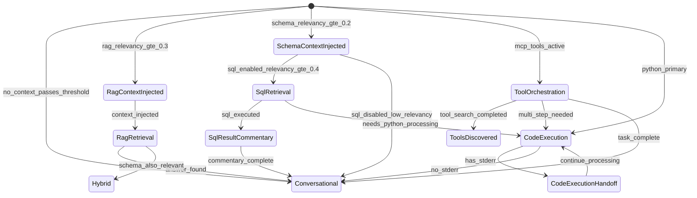

# Agentic Loop State Machine Redesign

## Overview

Transform the current ad-hoc tool availability logic into a formal state machine where each state:

1. Defines which tools are available
2. Generates a focused system prompt for that state
3. Determines valid transitions to other states
4. Enforces tool execution restrictions

The state machine will be driven by: user-configured settings, CLI overrides, runtime context (RAG attachments, schema search results), and relevancy scores.---

## Core Architecture

### State Definition ([`src-tauri/src/agentic_state.rs`](src-tauri/src/agentic_state.rs) - new file)

```rust
pub enum AgenticState {
    // === Turn-Start States (computed from settings + context) ===
    
    // Base conversational state - no tools
    Conversational,
    
    // RAG-focused state - document Q&A (relevancy is max chunk score)
    RagRetrieval { 
        max_chunk_relevancy: f32,
        schema_relevancy: f32,  // May still have SQL context
    },
    
    // SQL-focused state - database queries
    SqlRetrieval { 
        discovered_tables: Vec<TableInfo>,
        max_table_relevancy: f32,
    },
    
    // MCP tool-focused state
    ToolOrchestration { materialized_tools: Vec<String> },
    
    // Python code execution state
    CodeExecution { available_tools: Vec<String> },
    
    // Hybrid state - multiple capabilities active with relevancy scores
    Hybrid { 
        active_capabilities: HashSet<Capability>,
        rag_relevancy: f32,
        schema_relevancy: f32,
    },
    
    // === Mid-Turn States (after auto-discovery or tool execution) ===
    
    // After RAG retrieval finds relevant chunks - context injected
    RagContextInjected {
        chunks: Vec<RagChunk>,
        max_relevancy: f32,
        user_can_see_sources: bool,
    },
    
    // After schema_search finds relevant tables - context injected
    SchemaContextInjected {
        tables: Vec<TableInfo>,
        max_relevancy: f32,
        sql_enabled: bool,  // Only true if relevancy passes threshold
    },
    
    // After SQL returns data - model provides commentary
    SqlResultCommentary {
        results_shown_to_user: bool,
        row_count: usize,
        query_context: String,
    },
    
    // After Python execution with stderr - handoff for continuation
    CodeExecutionHandoff {
        stdout_shown_to_user: String,
        stderr_for_model: String,
    },
    
    // After tool_search discovers tools - ready to use them
    ToolsDiscovered {
        newly_materialized: Vec<String>,
        available_for_call: Vec<ToolSchema>,
    },
}

/// Relevancy thresholds for context injection
pub struct RelevancyThresholds {
    /// Minimum RAG chunk relevancy to inject into context (default: 0.3)
    pub rag_chunk_min: f32,
    /// Minimum schema table relevancy to inject into context (default: 0.2)
    pub schema_table_min: f32,
    /// Minimum schema relevancy to enable sql_select (default: 0.4)
    pub sql_enable_min: f32,
    /// RAG relevancy above which SQL context is suppressed (default: 0.6)
    pub rag_dominant_threshold: f32,
}

pub enum Capability {
    Rag,
    SqlQuery,
    McpTools,
    PythonExecution,
    SchemaSearch,
    ToolSearch,
}

/// Events that trigger state transitions mid-turn
pub enum StateEvent {
    /// RAG retrieval completed with chunks above threshold
    RagRetrieved { chunks: Vec<RagChunk>, max_relevancy: f32 },
    /// Schema search completed with tables above threshold
    SchemaSearched { tables: Vec<TableInfo>, max_relevancy: f32 },
    /// SQL query executed successfully
    SqlExecuted { results: SqlResults, row_count: usize },
    /// Python code executed
    PythonExecuted { stdout: String, stderr: String },
    /// Tool search discovered new tools
    ToolSearchCompleted { discovered: Vec<String> },
    /// MCP tool executed
    McpToolExecuted { tool_name: String, result: String },
    /// Model produced final response (no tool calls)
    ModelResponseFinal,
}

/// A retrieved RAG chunk with relevancy score
pub struct RagChunk {
    pub content: String,
    pub source_file: String,
    pub relevancy: f32,
}

/// Table info with relevancy for state machine
pub struct TableInfo {
    pub fully_qualified_name: String,
    pub source_id: String,
    pub sql_dialect: String,
    pub relevancy: f32,
    pub columns: Vec<ColumnInfo>,
}
```


### State Machine Controller ([`src-tauri/src/state_machine.rs`](src-tauri/src/state_machine.rs) - new file)

```rust
pub struct AgenticStateMachine {
    current_state: AgenticState,
    enabled_capabilities: HashSet<Capability>,
    state_history: Vec<AgenticState>,
}

impl AgenticStateMachine {
    /// Compute initial state from settings and context
    pub fn compute_initial_state(
        settings: &AppSettings,
        filter: &ToolLaunchFilter,
        has_attachments: bool,
        schema_search_result: Option<&SchemaSearchOutput>,
    ) -> AgenticState;
    
    /// Get available tools for current state
    pub fn available_tools(&self) -> Vec<ToolSchema>;
    
    /// Check if a tool call is allowed in current state
    pub fn is_tool_allowed(&self, tool_name: &str) -> bool;
    
    /// Transition to new state after tool execution
    pub fn transition(&mut self, event: StateEvent) -> AgenticState;
    
    /// Generate system prompt for current state
    pub fn build_system_prompt(&self, base_prompt: &str) -> String;
}
```

---

## State Transition Rules

### Turn-Start State Selection




### Mid-Turn States (Iteration Transitions)

The state machine tracks **mid-turn states** that occur between iterations within a single user turn. These handle auto-discovery results and tool execution results to determine how to prompt the model for follow-up.

#### RagContextInjected State

When RAG retrieval finds chunks with relevancy >= `rag_chunk_min`:

1. **Context Injection**: Relevant chunks are injected into the system prompt
2. **User Visibility**: Sources may be shown to user (configurable)
3. **State Transition**: Proceeds to `RagRetrieval` with context ready
```rust
pub struct RagContextInjected {
    chunks: Vec<RagChunk>,
    max_relevancy: f32,
    user_can_see_sources: bool,
}
```


**System prompt addition for RAG context:**

```javascript
## Retrieved Document Context

The following excerpts are relevant to the user's question (relevancy scores shown):

{chunks_with_scores}

Answer the user's question using this context. Cite sources when helpful.
If the context doesn't fully answer the question, say so clearly.
```


#### SchemaContextInjected State

When schema_search finds tables with relevancy >= `schema_table_min`:

1. **Context Injection**: Table schemas are injected into the system prompt
2. **SQL Gating**: `sql_select` only enabled if relevancy >= `sql_enable_min`
3. **State Transition**: Proceeds to `SqlRetrieval` if SQL enabled, else `Conversational`
```rust
pub struct SchemaContextInjected {
    tables: Vec<TableInfo>,
    max_relevancy: f32,
    sql_enabled: bool,
}
```


**System prompt addition for schema context:**

```javascript
## Discovered Database Tables

The following tables are relevant to the user's question:

{tables_with_columns_and_scores}

{if sql_enabled}
Use the `sql_select` tool to query these tables. Execute queries directly - do NOT show SQL code to the user.
{else}
Note: SQL execution is not available for this query (relevancy below threshold).
{endif}
```


#### SqlResultCommentary State

When `sql_select` executes successfully:

1. **Dual Display**: Results are displayed to the user immediately as a formatted table (via `tool-result` event to frontend)
2. **State Transition**: Machine transitions to `SqlResultCommentary` for the next iteration
3. **Commentary Prompt**: The model receives a modified system prompt:
```rust
pub struct SqlResultCommentary {
    /// The SQL results already shown to user
    displayed_results: SqlResults,
    /// Original query context
    query_context: String,
}
```


**System prompt for SqlResultCommentary state:**

```javascript
The user has received the query results in table form (shown above). Your role now is to:
1. Provide helpful commentary explaining what the data shows
2. Highlight any notable patterns, outliers, or insights
3. Suggest potential follow-up queries or next steps if relevant
4. Answer the user's original question based on the results

Do NOT re-display the data - the user already sees it. Focus on interpretation and guidance.
```


#### Python Stderr Handoff State

When `python_execution` produces stderr output:

1. **Stdout to User**: All stdout is displayed to the user immediately
2. **Stderr to Model**: Stderr content triggers another iteration
3. **Handoff Prompt**: Model receives stderr with instructions to continue
```rust
pub struct CodeExecutionHandoff {
    /// Stdout already shown to user
    user_visible_output: String,
    /// Stderr for model to process
    handoff_content: String,
}
```


**System prompt addition for handoff:**

````javascript
Your previous Python program produced the following on stderr (handoff channel):
---
{stderr_content}
---
The user has already seen the stdout output. Continue processing based on the stderr handoff.
If you need to run more code, output another ```python block.
If the task is complete, provide a final summary to the user.
````

---

## Key Changes to Existing Code

### 1. Tool Capability Resolution Refactor

Update [`src-tauri/src/tool_capability.rs`](src-tauri/src/tool_capability.rs):

- Add `ResolvedToolCapabilities::for_state(state: &AgenticState)` method
- Move tool availability logic into state machine
- Add `get_possible_states()` for settings UI

### 2. System Prompt Builder Refactor

Update [`src-tauri/src/lib.rs`](src-tauri/src/lib.rs) - `build_system_prompt()`:

- Replace current conditional logic with state-driven prompt sections
- Each state defines its own prompt additions
- Consolidate "no hallucination" warnings into one section
- Add Python stderr/stdout handling instructions in CodeExecution state only

### 3. Agentic Loop Integration

Update [`src-tauri/src/lib.rs`](src-tauri/src/lib.rs) - `run_agentic_loop()`:

- Initialize state machine at loop start
- Validate tool calls against current state before execution
- Transition state after each tool result
- Python stderr triggers loop continuation only in CodeExecution state

### 4. Settings State

Update [`src-tauri/src/settings.rs`](src-tauri/src/settings.rs):

- Existing boolean flags become inputs to state computation
- Add CLI flag mapping to `ToolLaunchFilter`

---

## State-Specific Prompt Templates

Each state generates focused prompts that only mention available tools:

### Turn-Start States

| State | Tools Available | Key Prompt Additions ||-------|-----------------|---------------------|| `Conversational` | None | Base prompt only || `RagRetrieval` | None | "Answer from attached documents; content already extracted" || `SqlRetrieval` | `sql_select` | Schema context, SQL format, "execute and return results" || `ToolOrchestration` | Active MCP tools | Tool descriptions, format instructions || `CodeExecution` | `python_execution`, discovered tools | Python sandbox rules, allowed imports, stdout/stderr semantics || `Hybrid` | Intersection of active | Combined focused sections |

### Mid-Turn States (After Auto-Discovery or Tool Execution)

| State | Tools Available | Key Prompt Additions ||-------|-----------------|---------------------|| `RagContextInjected` | Based on other capabilities | "Relevant document excerpts (shown below). Answer using this context." || `SchemaContextInjected` | `sql_select` if relevancy >= threshold | "Database tables discovered (shown below). Use sql_select to query." || `SqlResultCommentary` | None | "User sees the table. Provide interpretation, insights, and next steps. Do NOT re-display data." || `CodeExecutionHandoff` | `python_execution` | "Stderr handoff received. User saw stdout. Continue processing or summarize." || `ToolsDiscovered` | Newly materialized tools | "These tools are now available. Call them to complete the task." |

### Prompt Construction Rules

1. **No mention of disabled tools**: If SQL is disabled, zero SQL-related text appears
2. **Single grounding section**: One "Factual Accuracy" section at the top, not repeated per tool
3. **State-specific context injection**: Mid-turn states inject RAG chunks/schema tables/results into the prompt
4. **User visibility awareness**: Mid-turn prompts explicitly state what the user has already seen
5. **Relevancy-gated tools**: SQL only enabled when schema relevancy >= `sql_enable_min` threshold

---

## Relevancy-Based State Selection

All relevancy scores are f32 values (0.0 to 1.0) computed from embedding similarity:

- **RAG relevancy**: Max relevancy across all retrieved chunks for the user prompt
- **Schema relevancy**: Max relevancy across all matched tables from schema_search

### State Selection Logic

```rust
fn select_initial_state(
    rag_relevancy: f32,
    schema_relevancy: f32,
    thresholds: &RelevancyThresholds,
    enabled_capabilities: &HashSet<Capability>,
) -> AgenticState {
    let rag_passes = rag_relevancy >= thresholds.rag_chunk_min;
    let schema_passes = schema_relevancy >= thresholds.schema_table_min;
    let sql_enabled = schema_relevancy >= thresholds.sql_enable_min;
    let rag_dominant = rag_relevancy >= thresholds.rag_dominant_threshold;
    
    match (rag_passes, schema_passes, rag_dominant) {
        // RAG is dominant - suppress SQL context to focus the model
        (true, _, true) => AgenticState::RagRetrieval { 
            max_chunk_relevancy: rag_relevancy,
            schema_relevancy: 0.0,  // Suppressed
        },
        
        // Both relevant, neither dominant - hybrid mode
        (true, true, false) => AgenticState::Hybrid {
            active_capabilities: /* Rag + SqlQuery */,
            rag_relevancy,
            schema_relevancy,
        },
        
        // Only RAG relevant
        (true, false, _) => AgenticState::RagRetrieval {
            max_chunk_relevancy: rag_relevancy,
            schema_relevancy,
        },
        
        // Only schema relevant
        (false, true, _) => AgenticState::SqlRetrieval {
            discovered_tables: /* from schema_search */,
            max_table_relevancy: schema_relevancy,
        },
        
        // Neither passes threshold
        (false, false, _) => AgenticState::Conversational,
    }
}
```


### Threshold Defaults

| Threshold | Default | Purpose ||-----------|---------|---------|| `rag_chunk_min` | 0.3 | Minimum to inject RAG chunks into context || `schema_table_min` | 0.2 | Minimum to inject schema tables into context || `sql_enable_min` | 0.4 | Minimum to enable `sql_select` tool || `rag_dominant_threshold` | 0.6 | RAG relevancy above which SQL is suppressed |---

## Settings UI Enhancement

### Built-in Tools Settings Cards

Update [`src/components/Settings.tsx`](src/components/Settings.tsx) to add relevancy threshold sliders within the existing built-in tool cards:

#### Schema Search Card

Add a slider for `schema_table_min` threshold:

```javascript
┌─────────────────────────────────────────────────────┐
│ ☑ Schema Search                                     │
│                                                     │
│ Minimum Table Relevancy          [====|----] 0.20  │
│ (Tables below this score are not injected)         │
│                                                     │
│ SQL Enable Threshold             [======|--] 0.40  │
│ (sql_select only available above this score)       │
└─────────────────────────────────────────────────────┘
```


#### RAG / Document Attachment Card

Add a slider for `rag_chunk_min` threshold:

```javascript
┌─────────────────────────────────────────────────────┐
│ ☑ Document Retrieval (RAG)                          │
│                                                     │
│ Minimum Chunk Relevancy          [===|-----] 0.30  │
│ (Chunks below this score are not injected)         │
│                                                     │
│ RAG Dominant Threshold           [======|--] 0.60  │
│ (Above this, SQL context is suppressed)            │
└─────────────────────────────────────────────────────┘
```


### Backend Settings Changes

Update [`src-tauri/src/settings.rs`](src-tauri/src/settings.rs) - add threshold fields to `AppSettings`:

```rust
/// Relevancy thresholds for state machine (user-configurable)
#[serde(default)]
pub rag_chunk_min_relevancy: f32,        // default 0.3
#[serde(default)]
pub schema_table_min_relevancy: f32,     // default 0.2
#[serde(default)]
pub sql_enable_min_relevancy: f32,       // default 0.4
#[serde(default)]
pub rag_dominant_threshold: f32,         // default 0.6
```


### State Machine Preview Section

Add a "State Machine" section in the System Prompt tab that displays:

1. List of all possible states based on current enabled tools
2. For each state: the system prompt that would be generated
3. Visual indicator of which state would be active given current config

New Tauri command:

```rust
#[tauri::command]
async fn get_state_machine_preview() -> Result<Vec<StatePreview>, String>
```

---

## Implementation Order

1. Create `AgenticState` enum and `AgenticStateMachine` struct
2. Implement state computation from settings
3. Implement state-specific prompt generation
4. Integrate with agentic loop for tool validation
5. Add state transitions after tool execution
6. Update frontend settings UI
7. Add comprehensive tests

---

## Key Design Decisions

1. **Turn-start vs mid-turn states**: Turn-start states are computed from settings + context. Mid-turn states are triggered by tool execution results and change the prompt for the next iteration.
2. **Dual-channel output for tool results**:

- SQL results: Displayed to user as formatted table AND passed to model with "provide commentary" instructions
- Python stdout: Displayed to user immediately
- Python stderr: Passed to model as handoff for continuation (triggers next iteration)

3. **Deny by default**: If a tool isn't explicitly enabled for the current state, it's blocked even if the model outputs it