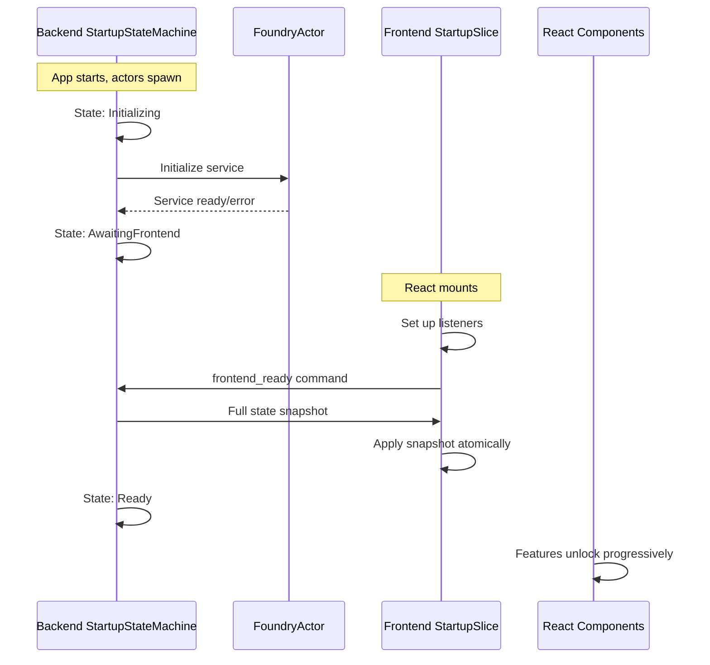

# Application Startup State Machine

## Problem Statement

Currently, the app has race conditions during startup:

- Backend emits `model-state-changed` events BEFORE frontend listeners are set up
- Multiple independent initialization sequences run in parallel without coordination
- No single source of truth for "is the app ready?"
- Recovery mechanisms are ad-hoc (timeouts, retries)

## Architecture Overview



## Design Principles

1. **Backend is authoritative** - Backend tracks what resources are actually available
2. **Frontend requests state** - Frontend initiates sync via handshake, not by catching events
3. **Progressive unlock** - UI shows immediately, features enable as subsystems become ready
4. **Graceful degradation** - App is usable even if some subsystems fail (e.g., no embeddings)

## Backend Changes

### 1. New StartupState Enum ([src-tauri/src/protocol.rs](src-tauri/src/protocol.rs))

```rust
#[derive(Debug, Clone, Serialize, Deserialize, PartialEq)]
#[serde(tag = "state", rename_all = "snake_case")]
pub enum StartupState {
    /// Initial state, actors spawning
    Initializing,
    /// Foundry service detection in progress
    ConnectingToFoundry,
    /// Waiting for frontend to signal ready
    AwaitingFrontend,
    /// Frontend connected, app fully operational
    Ready,
    /// Startup failed unrecoverably
    Failed { message: String },
}
```

### 2. Subsystem Status Tracking ([src-tauri/src/protocol.rs](src-tauri/src/protocol.rs))

```rust
#[derive(Debug, Clone, Serialize, Deserialize, Default)]
pub struct SubsystemStatus {
    pub foundry_service: ResourceStatus,
    pub model: ResourceStatus,
    pub cpu_embedding: ResourceStatus,
    pub mcp_servers: ResourceStatus,
    pub settings: ResourceStatus,
}

#[derive(Debug, Clone, Serialize, Deserialize, Default)]
#[serde(tag = "status", rename_all = "snake_case")]
pub enum ResourceStatus {
    #[default]
    Pending,
    Initializing,
    Ready,
    Failed { message: String },
    Unavailable, // Optional feature not configured
}
```

### 3. New StartupActor ([src-tauri/src/actors/startup_actor.rs](src-tauri/src/actors/startup_actor.rs))

Coordinates startup sequence:

- Receives status updates from other actors via channel messages
- Tracks overall `StartupState`
- Holds current state snapshot for handshake response
- Emits `startup-progress` events for UI progress indicators

### 4. Handshake Command ([src-tauri/src/commands/startup.rs](src-tauri/src/commands/startup.rs))

```rust
#[tauri::command]
pub async fn frontend_ready(
    handles: State<'_, ActorHandles>,
) -> Result<StartupSnapshot, String> {
    // Returns full current state: StartupState, ModelState, 
    // available models, subsystem statuses, etc.
}
```

### 5. Actor Message Extensions

Add `ReportReady` message variants to existing actors:

- `FoundryMsg::ReportStartupStatus { status: ResourceStatus, respond_to: ... }`
- `McpHostMsg::ReportStartupStatus { ... }`

## Frontend Changes

### 1. New Startup Slice ([src/store/chat/slices/startup-slice.ts](src/store/chat/slices/startup-slice.ts))

```typescript
interface StartupSlice {
    startupState: StartupState;
    subsystemStatus: SubsystemStatus;
    isAppReady: boolean;
    
    // Handshake
    performHandshake: () => Promise<void>;
    
    // Subsystem checks
    isFoundryReady: boolean;
    isModelReady: boolean;
    isEmbeddingReady: boolean;
}
```

### 2. Refactored Listener Setup ([src/store/chat/listeners.ts](src/store/chat/listeners.ts))

```typescript
setupListeners: async () => {
    // 1. Set up all event listeners FIRST (no fetches yet)
    const listeners = await setupAllListeners();
    
    // 2. Signal backend that frontend is ready
    const snapshot = await invoke('frontend_ready');
    
    // 3. Apply snapshot atomically (model state, models, etc.)
    applyStartupSnapshot(snapshot);
    
    // 4. Start background initialization (non-blocking)
    initializeModelsOnStartup(get, set);
}
```

### 3. Startup Progress Component ([src/components/StartupProgress.tsx](src/components/StartupProgress.tsx))

Replace ad-hoc "Initializing..." with structured progress:

- Shows subsystem status in collapsed footer
- Expands on click to show details
- Indicates which features are available

## Migration Strategy

1. **Phase 1**: Add `StartupState` and `SubsystemStatus` types, add `frontend_ready` command
2. **Phase 2**: Implement `StartupActor`, wire up status reporting from existing actors
3. **Phase 3**: Refactor frontend to use handshake pattern
4. **Phase 4**: Remove ad-hoc recovery mechanisms (timeout retries)

## Key Files to Modify

| File | Changes |

|------|---------|

| [src-tauri/src/protocol.rs](src-tauri/src/protocol.rs) | Add `StartupState`, `SubsystemStatus`, `StartupSnapshot` types |

| [src-tauri/src/actors/mod.rs](src-tauri/src/actors/mod.rs) | Add `StartupActor` module |

| [src-tauri/src/actors/startup_actor.rs](src-tauri/src/actors/startup_actor.rs) | New file - startup coordinator |

| [src-tauri/src/lib.rs](src-tauri/src/lib.rs) | Spawn `StartupActor`, add to `ActorHandles` |

| [src-tauri/src/commands/startup.rs](src-tauri/src/commands/startup.rs) | New file - `frontend_ready` command |

| [src/store/chat/slices/startup-slice.ts](src/store/chat/slices/startup-slice.ts) | New file - startup state slice |

| [src/store/chat/listeners.ts](src/store/chat/listeners.ts) | Refactor to use handshake pattern |

| [src/components/StatusBar.tsx](src/components/StatusBar.tsx) | Update to use `StartupState` |

## Benefits

1. **No race conditions** - Handshake ensures frontend receives complete state
2. **Clear progress** - Users see meaningful startup phases
3. **Graceful degradation** - App works with partial subsystem availability
4. **Debuggable** - Single place to check startup status
5. **Testable** - State machine has deterministic transitions