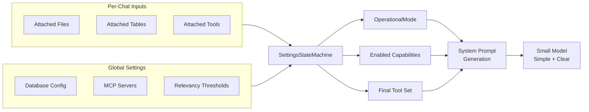
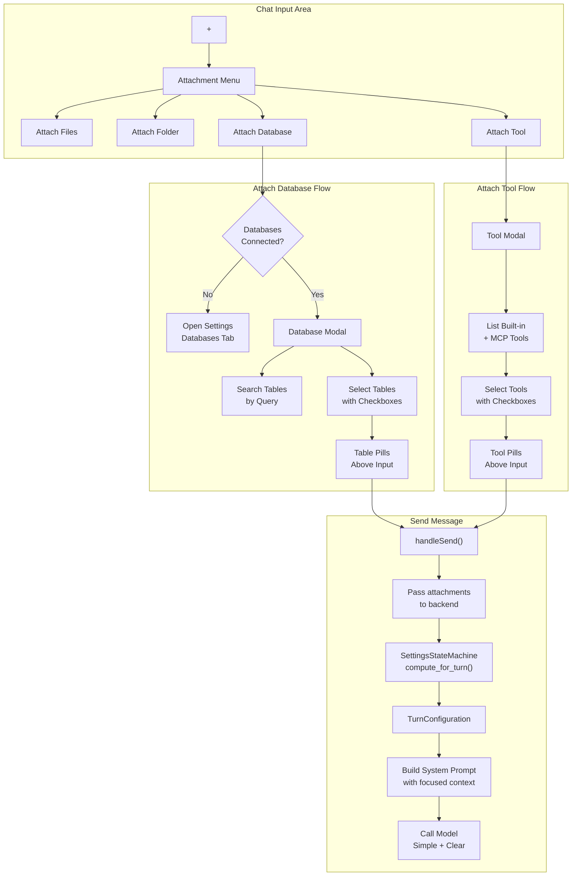

# Per-Chat Database and Tool Attachments

## Summary

Move database table selection and tool enablement from global settings to per-chat attachments, simplifying the experience for small models by encouraging users to attach only the specific tables and tools needed for each request.

## Architecture: Integration with Settings State Machine

The **SettingsStateMachine** ([`src-tauri/src/settings_state_machine.rs`](src-tauri/src/settings_state_machine.rs)) remains the single source of truth for computing the operational mode. Per-chat attachments become **inputs** to the state machine, which rationalizes conflicts and produces a clear, simple configuration for the model.



### State Machine Responsibilities

1. **Conflict Resolution**: Mutual exclusivity between RAG files and database tables is enforced at the UI level, but the state machine serves as the final arbiter if conflicts arise
2. **Mode Selection**: Attachments drive the `OperationalMode`:

   - Files attached → enables `SimplifiedMode::Rag`
   - Tables attached → enables `SimplifiedMode::Sql` (auto-enables `sql_select`)
   - Tools attached → enables `SimplifiedMode::Tool` or `SimplifiedMode::Code` based on tool type

3. **Capability Gating**: Only capabilities corresponding to actual attachments are enabled for that chat turn, keeping the model's context focused
4. **Tool Filtering**: The final tool set sent to the model is computed by:

   - Starting with user-attached tools
   - Intersecting with globally configured/available tools
   - Filtering by model-supported tool formats
   - Adding implicit tools (e.g., `sql_select` when tables attached)

5. **Prompt Simplification**: The state machine ensures the system prompt only describes capabilities that are actually available for this turn

### New Input Type: ChatTurnContext

Extend the state machine to accept per-turn context:

**File:** [`src-tauri/src/settings_state_machine.rs`](src-tauri/src/settings_state_machine.rs)

```rust
/// Per-chat-turn context that influences state machine computation
#[derive(Debug, Clone, Default)]
pub struct ChatTurnContext {
    /// Files/folders attached for RAG
    pub attached_files: Vec<String>,
    /// Database tables attached for SQL queries
    pub attached_tables: Vec<AttachedTableInfo>,
    /// Tools explicitly attached for this chat
    pub attached_tools: Vec<String>,
}

#[derive(Debug, Clone)]
pub struct AttachedTableInfo {
    pub source_id: String,
    pub table_fq_name: String,
    pub schema_text: String,  // Pre-fetched schema for prompt inclusion
}

impl SettingsStateMachine {
    /// Compute operational mode with per-turn context overrides
    pub fn compute_for_turn(
        &self,
        settings: &AppSettings,
        filter: &ToolLaunchFilter,
        turn_context: &ChatTurnContext,
    ) -> TurnConfiguration {
        // 1. Start with base mode from settings
        // 2. Override based on attachments
        // 3. Resolve conflicts (e.g., if tool_search attached but no MCP servers)
        // 4. Return simplified, focused configuration
    }
}

/// Configuration for a specific chat turn
#[derive(Debug, Clone)]
pub struct TurnConfiguration {
    pub mode: OperationalMode,
    pub enabled_tools: Vec<String>,
    pub schema_context: Option<String>,  // SQL schemas to include in prompt
    pub rag_context: Option<String>,     // RAG chunks to include
}
```

This ensures the state machine remains the authoritative decision-maker while accepting per-chat inputs, and produces a rationalized, conflict-free configuration.

## Key Changes

### 1. Remove Schemas Tab, Move Refresh Button to Databases Tab

**File:** [`src/components/Settings.tsx`](src/components/Settings.tsx)

- Remove the `SchemasTab` component and all references (`showSchemasTab`, `schemasDirty`, `schemasSaving`, etc.)
- Move the "Refresh Schemas" button into each database source card in `DatabasesTab`
- Add the "Refresh" button next to each enabled source with a loading indicator
- Remove table enable/disable toggles entirely - all cached tables are available for attachment

### 2. Add Per-Chat Attachment State

**File:** [`src/store/chat-store.ts`](src/store/chat-store.ts)

Add new state for per-chat attachments:

```typescript
interface AttachedTable {
    sourceId: string;
    sourceName: string;
    tableFqName: string;
    columnCount: number;
}

interface AttachedTool {
    key: string;        // "builtin::python_execution" or "mcp-server-id::tool_name"
    name: string;
    server: string;     // "builtin" or MCP server name
    isBuiltin: boolean;
}

// Per-chat attached database tables
attachedDatabaseTables: AttachedTable[];
addAttachedTable: (table: AttachedTable) => void;
removeAttachedTable: (tableFqName: string) => void;
clearAttachedTables: () => void;

// Per-chat attached tools (built-in + MCP)
attachedTools: AttachedTool[];
addAttachedTool: (tool: AttachedTool) => void;
removeAttachedTool: (toolKey: string) => void;
clearAttachedTools: () => void;
```

Clear these when `currentChatId` changes to null (new chat).

### 3. Add "Attach Database" Menu Option

**File:** [`src/components/ChatArea.tsx`](src/components/ChatArea.tsx)

Modify `AttachmentMenu` component:

- Add "Attach Database" option (with database icon)
- Grey out based on mutual exclusivity rules:
  - If files/folders attached, grey out "Attach Database"
  - If tables attached, grey out "Attach Files" and "Attach Folder"

On click:

- If no databases connected: Call `useSettingsStore().openSettings()` then `setActiveTab('databases')`
- If databases connected: Open `DatabaseAttachmentModal`

### 4. Create DatabaseAttachmentModal Component

**New File:** Create within `src/components/ChatArea.tsx` or extract to `src/components/DatabaseAttachmentModal.tsx`

Modal functionality:

- Fetch all cached tables via existing `get_cached_database_schemas` command
- Use draft input text from chat input for embedding similarity search via new backend command `search_database_tables`
- Display scrolling list sorted by relevance score, with checkboxes
- Pre-check tables already in `attachedDatabaseTables`
- On confirm: update `attachedDatabaseTables` in store

### 5. Add "Attach Tool" Menu Option

**File:** [`src/components/ChatArea.tsx`](src/components/ChatArea.tsx)

Add fourth option to `AttachmentMenu`:

- "Attach Tool" with wrench/tool icon

### 6. Create ToolAttachmentModal Component

**New File:** Within `src/components/ChatArea.tsx` or separate file

Modal functionality:

- List all available tools:
  - Built-in tools: `python_execution`, `tool_search`, `schema_search`, `sql_select`
  - MCP tools from all connected servers (from `serverStatuses[serverId].tools`)
- Checkboxes for multi-select
- Pre-check tools already in `attachedTools`
- Show tool name, description, and server (for MCP tools)
- On confirm: update `attachedTools` in store

### 7. Display Attached Tables/Tools as Pills

**File:** [`src/components/ChatArea.tsx`](src/components/ChatArea.tsx)

Create `AttachedTablePills` and `AttachedToolPills` components (similar to `RagFilePills`):

- Show attached database tables with table icon and truncated name
- Show attached tools with wrench icon
- Each pill has an X button to remove

Display above the input bar alongside RAG file pills.

### 8. Backend: State Machine Integration

**File:** [`src-tauri/src/settings_state_machine.rs`](src-tauri/src/settings_state_machine.rs)

Add `ChatTurnContext` and `compute_for_turn()` as described above. The state machine will:

1. Accept attachments as input
2. Compute which `SimplifiedMode` flags to enable
3. Auto-enable implicit tools (e.g., `sql_select` when tables attached)
4. Filter out tools that aren't configured globally
5. Return a `TurnConfiguration` with the rationalized tool set

### 9. Backend: Search Database Tables Command

**File:** [`src-tauri/src/commands/database.rs`](src-tauri/src/commands/database.rs)

Add new command:

```rust
#[tauri::command]
pub async fn search_database_tables(
    query: String,
    limit: usize,
    handles: State<'_, ActorHandles>,
    embedding_state: State<'_, EmbeddingModelState>,
) -> Result<Vec<TableSearchResult>, String>
```

- Embed the query
- Search against cached table embeddings via `SchemaVectorMsg::SearchTables`
- Return sorted by similarity score

### 10. Modify Chat Command to Use State Machine

**File:** [`src-tauri/src/commands/chat.rs`](src-tauri/src/commands/chat.rs)

Extend the `chat` command to accept per-chat context and delegate to state machine:

```rust
#[tauri::command]
pub async fn chat(
    // ... existing params ...
    attached_files: Vec<String>,
    attached_tables: Vec<AttachedTableInfo>,
    attached_tools: Vec<String>,
) -> Result<String, String> {
    // Build ChatTurnContext from attachments
    let turn_context = ChatTurnContext {
        attached_files,
        attached_tables,
        attached_tools,
    };
    
    // Let state machine compute final configuration
    let turn_config = settings_state_machine
        .compute_for_turn(&settings, &filter, &turn_context);
    
    // Use turn_config.enabled_tools for tool definitions
    // Use turn_config.schema_context for system prompt
    // ...
}
```

### 11. StatusBar Tools Icon Link

**File:** [`src/components/StatusBar.tsx`](src/components/StatusBar.tsx) or relevant component

- Find the Tools icon next to "Model:" in status bar
- Make it clickable to open Settings on Tools tab

### 12. Add Help Text to Settings Pages

**File:** [`src/components/Settings.tsx`](src/components/Settings.tsx)

Add one-line help at bottom of:

- Built-ins tab: "Select **+ Attach Tool** in chat to use an enabled tool"
- Tools tab: "Select **+ Attach Tool** in chat to use an enabled tool"

### 13. Modify Built-ins Tab

**File:** [`src/components/Settings.tsx`](src/components/Settings.tsx)

Since all enablement moves to "Attach Tool":

- Remove enable/disable toggles for `python_execution`, `tool_search`, `schema_search`, `sql_select`
- Keep configuration options only (e.g., max results, relevancy thresholds, allowed imports)
- Restructure as "Tool Configuration" with settings for each tool type

## Data Flow



## Files to Modify

| File | Changes |

|------|---------|

| `src/store/chat-store.ts` | Add attached tables/tools state, clear on new chat |

| `src/components/ChatArea.tsx` | AttachmentMenu options, modals, pills, mutual exclusivity |

| `src/components/Settings.tsx` | Remove Schemas tab, move Refresh to Databases, refactor Built-ins |

| `src/components/StatusBar.tsx` | Make Tools icon clickable link |

| `src/store/settings-store.ts` | May need new actions for tool availability vs enablement |

| `src-tauri/src/settings_state_machine.rs` | Add ChatTurnContext, compute_for_turn(), TurnConfiguration |

| `src-tauri/src/commands/database.rs` | Add `search_database_tables` command |

| `src-tauri/src/commands/chat.rs` | Accept attachments, delegate to state machine |

| `src-tauri/src/lib.rs` | Register new command |

## Migration Notes

- Users with existing enabled schemas will need to re-attach them per chat
- Global tool settings become "configuration" settings rather than "enabled" settings
- The state machine ensures backwards compatibility by falling back to global settings when no per-chat attachments are present
- Consider adding a migration notice or first-run help message