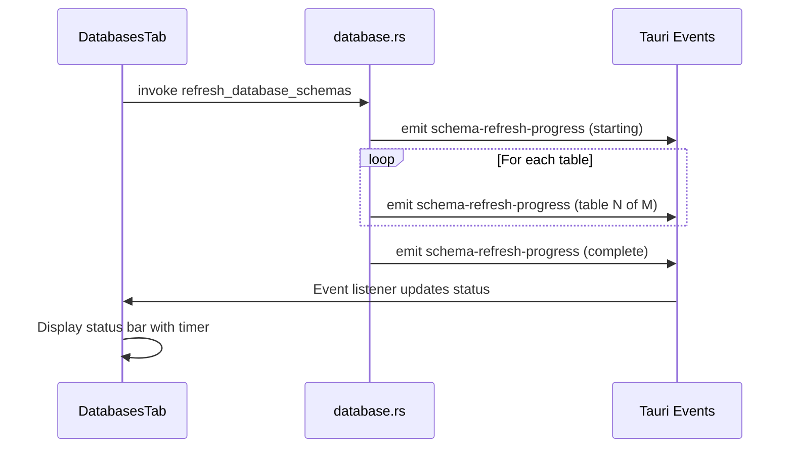

# Database Schema Refresh Status Bar

## Architecture

The implementation follows the existing pattern used by `embedding-init-progress` and `rag-progress` events:



## Backend Changes

### 1. Add AppHandle to refresh functions

Modify [src-tauri/src/commands/database.rs](src-tauri/src/commands/database.rs) to accept `AppHandle` and emit progress events:

- Add a new event payload struct `SchemaRefreshProgress`:
```rust
#[derive(Clone, Serialize)]
pub struct SchemaRefreshProgress {
    pub message: String,
    pub source_name: String,
    pub current_table: Option<String>,
    pub tables_done: usize,
    pub tables_total: usize,
    pub is_complete: bool,
    pub error: Option<String>,
}
```

- Update `refresh_schema_cache_for_source` to emit events at key points:
  - When starting a source
  - When enumerating datasets
  - When processing each table (with table count)
  - When complete or on error

- Update the Tauri command `refresh_database_schemas` to pass AppHandle

### 2. Add progress emission points

In the table processing loop (~line 847), emit progress like:

```rust
let _ = app_handle.emit("schema-refresh-progress", SchemaRefreshProgress {
    message: format!("Processing table {}/{}", current, total),
    source_name: source.name.clone(),
    current_table: Some(fq_name.clone()),
    tables_done: current,
    tables_total: total,
    is_complete: false,
    error: None,
});
```

## Frontend Changes

### 3. Add status bar state to DatabasesTab

In [src/components/Settings.tsx](src/components/Settings.tsx), add local state to the `DatabasesTab` component:

```typescript
interface SchemaRefreshStatus {
    message: string;
    sourceName: string;
    currentTable?: string;
    tablesDone: number;
    tablesTotal: number;
    isComplete: boolean;
    error?: string;
    startTime: number;
}

const [refreshStatus, setRefreshStatus] = useState<SchemaRefreshStatus | null>(null);
```

### 4. Add Tauri event listener

Add a `useEffect` in `DatabasesTab` to listen for `schema-refresh-progress` events:

```typescript
useEffect(() => {
    const unlisten = listen<SchemaRefreshProgress>('schema-refresh-progress', (event) => {
        setRefreshStatus({
            ...event.payload,
            startTime: refreshStatus?.startTime || Date.now(),
        });
        if (event.payload.is_complete) {
            setTimeout(() => setRefreshStatus(null), 3000);
        }
    });
    return () => { unlisten.then(fn => fn()); };
}, []);
```

### 5. Add status bar UI component

Create a `SchemaRefreshStatusBar` component inside `DatabasesTab` that displays:

- Left side: Status message and current table name
- Right side: Elapsed timer (using the existing `formatElapsedTime` pattern)
```typescript
function SchemaRefreshStatusBar({ status }: { status: SchemaRefreshStatus }) {
    const [elapsed, setElapsed] = useState(0);
    
    useEffect(() => {
        if (status.isComplete) return;
        const interval = setInterval(() => {
            setElapsed(Math.floor((Date.now() - status.startTime) / 1000));
        }, 1000);
        return () => clearInterval(interval);
    }, [status.startTime, status.isComplete]);
    
    return (
        <div className="flex items-center justify-between px-4 py-2 bg-blue-50 border border-blue-200 rounded-lg">
            <div className="flex items-center gap-2">
                <Loader2 className="animate-spin" size={16} />
                <span>{status.message}</span>
            </div>
            <span className="font-mono text-sm">{formatElapsedTime(elapsed)}</span>
        </div>
    );
}
```


### 6. Render status bar in DatabasesTab

Place the status bar between the error alert and the toolbox toggle (~line 2669):

```typescript
{refreshStatus && (
    <SchemaRefreshStatusBar status={refreshStatus} />
)}
```

## Files to Modify

- [src-tauri/src/commands/database.rs](src-tauri/src/commands/database.rs) - Add progress event emission
- [src/components/Settings.tsx](src/components/Settings.tsx) - Add status bar UI and event listener