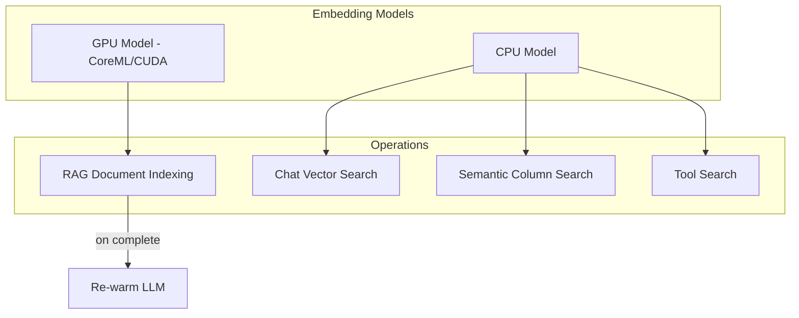

# Dual Embedding Models for GPU Contention Avoidance

## Problem Summary

Debug logs confirmed that when the embedding model uses CoreML (Mac GPU), it evicts Foundry's pre-warmed LLM from GPU memory, causing 10+ second reload delays on the next chat request. The solution is to use GPU for background RAG indexing (when LLM latency doesn't matter) and CPU for search operations during active chat.

## Architecture Changes



## Implementation Steps

### 1. Extend EmbeddingModelState to hold two models

Modify [`src-tauri/src/app_state.rs`](src-tauri/src/app_state.rs):

```rust
pub struct EmbeddingModelState {
    /// GPU-accelerated model for background RAG indexing
    pub gpu_model: Arc<RwLock<Option<Arc<TextEmbedding>>>>,
    /// CPU-only model for search during chat (avoids LLM eviction)
    pub cpu_model: Arc<RwLock<Option<Arc<TextEmbedding>>>>,
}
```

### 2. Initialize both models in FoundryActor

Modify [`src-tauri/src/actors/foundry_actor.rs`](src-tauri/src/actors/foundry_actor.rs):

- Keep existing GPU model initialization (with CoreML on Mac, CUDA on Windows)
- Add second initialization block for CPU-only model (empty execution providers list)
- Store both in the shared state
- Update `ModelGatewayActor::new()` to accept both model references

### 3. Add use_gpu parameter to GetEmbedding message

Modify [`src-tauri/src/protocol.rs`](src-tauri/src/protocol.rs):

```rust
GetEmbedding {
    text: String,
    use_gpu: bool,  // NEW: true for RAG indexing, false for search
    respond_to: oneshot::Sender<Vec<f32>>,
}
```

### 4. Update GetEmbedding handler to select correct model

In [`src-tauri/src/actors/foundry_actor.rs`](src-tauri/src/actors/foundry_actor.rs), the handler selects model based on `use_gpu` flag:

```rust
FoundryMsg::GetEmbedding { text, use_gpu, respond_to } => {
    let model_guard = if use_gpu {
        self.shared_gpu_embedding_model.read().await
    } else {
        self.shared_cpu_embedding_model.read().await
    };
    // ... rest of embedding logic
}
```

### 5. Update all GetEmbedding call sites with use_gpu: false

These are search operations during chat that should use CPU:

- [`src-tauri/src/commands/chat.rs`](src-tauri/src/commands/chat.rs) - `search_chats` (line 27)
- [`src-tauri/src/commands/rag.rs`](src-tauri/src/commands/rag.rs) - `search_rag_chunks` (line 72)
- [`src-tauri/src/lib.rs`](src-tauri/src/lib.rs) - vector search mid-turn (line 2385)

### 6. Update RAG indexing to use GPU model

Modify [`src-tauri/src/commands/rag.rs`](src-tauri/src/commands/rag.rs):

```rust
// Use GPU model for RAG indexing (background operation)
let embedding_model = embedding_state.gpu_model.read().await
    .clone()
    .ok_or("GPU Embedding model not ready")?;
```

### 7. Update inline embeddings in lib.rs to use CPU model

The semantic column search in [`src-tauri/src/lib.rs`](src-tauri/src/lib.rs) (around line 2820) should use the CPU model:

```rust
let model_guard = embedding_state.cpu_model.read().await;
```

### 8. Add LLM re-warm trigger after RAG indexing

Modify [`src-tauri/src/commands/rag.rs`](src-tauri/src/commands/rag.rs) `process_rag_documents`:

After successful indexing, send a message to trigger model pre-warming:

```rust
// After successful RAG indexing, re-warm the LLM
if result.is_ok() {
    let (rewarm_tx, _) = oneshot::channel();
    let _ = handles.foundry_tx.send(FoundryMsg::RewarmCurrentModel {
        respond_to: rewarm_tx,
    }).await;
}
```

### 9. Add RewarmCurrentModel message to FoundryMsg

Modify [`src-tauri/src/protocol.rs`](src-tauri/src/protocol.rs):

```rust
/// Re-warm the currently selected model (after GPU-intensive operations)
RewarmCurrentModel {
    respond_to: oneshot::Sender<()>,
},
```

### 10. Implement RewarmCurrentModel handler

In [`src-tauri/src/actors/foundry_actor.rs`](src-tauri/src/actors/foundry_actor.rs):

```rust
FoundryMsg::RewarmCurrentModel { respond_to } => {
    if let Some(model_id) = &self.model_id {
        println!("FoundryActor: Re-warming model after GPU operation: {}", model_id);
        self.prewarm_model_in_background(model_id.clone());
    }
    let _ = respond_to.send(());
}
```

## Files to Modify

| File | Changes |

|------|---------|

| `src-tauri/src/app_state.rs` | Add `gpu_model` and `cpu_model` fields |

| `src-tauri/src/protocol.rs` | Add `use_gpu` param to GetEmbedding, add RewarmCurrentModel |

| `src-tauri/src/actors/foundry_actor.rs` | Initialize both models, handle model selection, add rewarm handler |

| `src-tauri/src/commands/rag.rs` | Use GPU model for indexing, trigger rewarm after |

| `src-tauri/src/commands/chat.rs` | Pass `use_gpu: false` to GetEmbedding |

| `src-tauri/src/commands/database.rs` | Pass `use_gpu: false` for schema search |

| `src-tauri/src/lib.rs` | Use CPU model for inline embeddings, pass `use_gpu: false` |

## Memory Impact

- Additional ~100-150MB for the second embedding model (BGE-Base-EN-v1.5)
- Trade-off is worthwhile to avoid 10+ second LLM reload penalties

## Testing Verification

After implementation, debug logs should show:

1. `embedding_model_init_config` with two models initialized
2. RAG indexing using GPU model
3. Chat searches using CPU model
4. `prewarm_model_starting` after RAG document attachment
5. First chat TTFT should be consistent (~1-2s) regardless of prior RAG operations