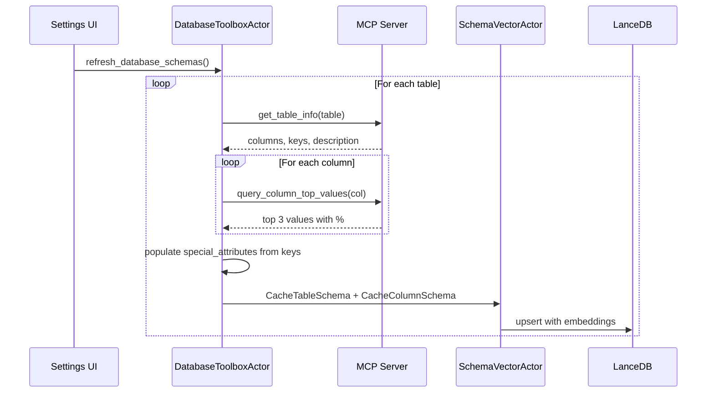
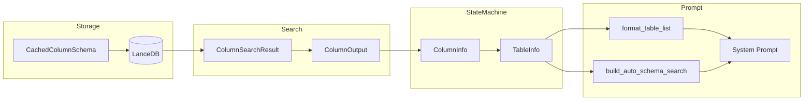

# Enhanced Schema Metadata for Database Caching

## Current State

The current `CachedColumnSchema` struct in [settings.rs](src-tauri/src/settings.rs) stores minimal column info:

```rust
pub struct CachedColumnSchema {
    pub name: String,
    pub data_type: String,
    pub nullable: bool,
    pub description: Option<String>,
}
```

Table-level key info is stored separately in `CachedTableSchema` (primary_keys, partition_columns, cluster_columns).

## Changes Overview

### 1. Extend `CachedColumnSchema` Struct

Add new fields to [src-tauri/src/settings.rs](src-tauri/src/settings.rs):

```rust
pub struct CachedColumnSchema {
    pub name: String,
    pub data_type: String,
    pub nullable: bool,
    #[serde(default)]
    pub description: Option<String>,
    /// Special attributes: "primary_key", "foreign_key", "partition", "cluster"
    #[serde(default)]
    pub special_attributes: Vec<String>,
    /// Top 3 most common values with percentage (e.g., "THEFT (23.5%)")
    #[serde(default)]
    pub top_values: Vec<String>,
}
```

### 2. Extend LanceDB Schema for Columns

Update the `columns_table_schema()` function in [src-tauri/src/actors/schema_vector_actor.rs](src-tauri/src/actors/schema_vector_actor.rs) to add new fields:

- `special_attributes` (UTF8, JSON array string)
- `top_values` (UTF8, JSON array string)

The schema migration logic (field count check) will auto-recreate the table when fields change.

### 3. Add Top Values Query Support

In [src-tauri/src/actors/database_toolbox_actor.rs](src-tauri/src/actors/database_toolbox_actor.rs), add a new method `query_column_top_values()` that:

- Generates appropriate SQL for each database kind (BigQuery, Postgres, MySQL, SQLite, Spanner)
- Returns top 3 values with percentage of total rows
- Handles errors gracefully (some columns may fail due to permissions/types)

SQL pattern example for BigQuery:

```sql
SELECT col_name AS val, COUNT(*) * 100.0 / (SELECT COUNT(*) FROM table) AS pct
FROM table
WHERE col_name IS NOT NULL
GROUP BY col_name
ORDER BY COUNT(*) DESC
LIMIT 3
```

### 4. Enhance `get_table_info()` to Populate New Fields

Modify `parse_bigquery_table_info()` and `get_table_info_via_information_schema()` in [database_toolbox_actor.rs](src-tauri/src/actors/database_toolbox_actor.rs) to:

- Populate `special_attributes` by cross-referencing column names with table-level key lists
- Query `top_values` for each column during schema refresh

### 5. Update Embedded Demo Schema

Update [src-tauri/src/demo_schema.rs](src-tauri/src/demo_schema.rs) to:

- Add `special_attributes` to the `id` column (primary_key)
- Add sample `top_values` for enum-like columns (e.g., `primary_type`, `season`, `crime_category`)

This will require querying the actual demo.db to get real top values on first load.

### 6. Enhance Embedding Text for Better Semantic Search

Update `build_column_embedding_text()` in [src-tauri/src/commands/database.rs](src-tauri/src/commands/database.rs) to include:

- Special attributes in the embedding text (e.g., "primary_key" to boost relevance for join queries)
- Top values for better semantic matching (e.g., "values: THEFT, BATTERY, ASSAULT")
```rust
pub fn build_column_embedding_text(table_name: &str, column: &CachedColumnSchema) -> String {
    let attrs = if column.special_attributes.is_empty() {
        String::new()
    } else {
        format!(" [{}]", column.special_attributes.join(", "))
    };
    
    let top_vals = if column.top_values.is_empty() {
        String::new()
    } else {
        format!("; examples: {}", column.top_values.join(", "))
    };
    
    format!(
        "column {}.{} type {} {}{}; description: {}{}",
        table_name,
        column.name,
        column.data_type,
        if column.nullable { "nullable" } else { "not null" },
        attrs,
        column.description.clone().unwrap_or_else(|| "none".to_string()),
        top_vals
    )
}
```


### 7. Update Column Search Result

Extend `ColumnSearchResult` in [schema_vector_actor.rs](src-tauri/src/actors/schema_vector_actor.rs) to include new fields:

- `special_attributes: Vec<String>`
- `top_values: Vec<String>`

Update `search_columns()` to read and return these fields.

### 8. Update Schema Search Output

Extend `ColumnOutput` in [src-tauri/src/tools/schema_search.rs](src-tauri/src/tools/schema_search.rs) to include the new fields so they're visible to the model.

### 9. Update `ColumnInfo` for State Machine

Extend `ColumnInfo` in [src-tauri/src/agentic_state.rs](src-tauri/src/agentic_state.rs) to include the new fields:

```rust
pub struct ColumnInfo {
    pub name: String,
    pub data_type: String,
    pub nullable: bool,
    pub description: Option<String>,
    #[serde(default)]
    pub special_attributes: Vec<String>,  // NEW
    #[serde(default)]
    pub top_values: Vec<String>,  // NEW
}
```

This propagates metadata through the state machine to the system prompt.

### 10. Enhance System Prompt Formatting (Token-Conscious)

Update [src-tauri/src/system_prompt.rs](src-tauri/src/system_prompt.rs) to output enhanced column info while being mindful of context limits.

**Key Principles for Small Models:**

- Prioritize columns that are keys (primary, partition, cluster) - always show these first
- Show top values only for enum-like columns (those with top_values populated)
- Use compact notation to minimize tokens
- Cap column output per table (already limited to 40 columns)

**Updated `format_table_list()` Output Format:**

```
- **main.chicago_crimes** [SQLite Syntax] (queryable via `sql_select`, relevancy: 0.85)
  Description: Chicago crime incidents from 2025
  Key columns: id (PK), date
  Columns: id (INTEGER PK), case_number (TEXT), date (TEXT), primary_type (TEXT: THEFT 23%, BATTERY 15%, ASSAULT 12%), ...
```

**Format Strategy:**

- `(PK)` suffix for primary key columns
- `(PART)` suffix for partition columns  
- `(CLUST)` suffix for cluster columns
- For columns with top_values: `column_name (TYPE: val1 X%, val2 Y%, val3 Z%)`
- For columns without top_values: `column_name (TYPE)`

**Updated `build_auto_schema_search_section()` changes:**

- Same compact format as `format_table_list()`
- Include top values inline with column type when available

**Helper Function:**

```rust
/// Format a single column for the system prompt (compact, token-efficient)
fn format_column_compact(col: &ColumnInfo) -> String {
    let mut parts = vec![col.name.clone()];
    
    // Build type with attributes
    let mut type_parts = vec![col.data_type.clone()];
    
    // Add key suffixes
    for attr in &col.special_attributes {
        match attr.as_str() {
            "primary_key" => type_parts.push("PK".to_string()),
            "partition" => type_parts.push("PART".to_string()),
            "cluster" => type_parts.push("CLUST".to_string()),
            "foreign_key" => type_parts.push("FK".to_string()),
            _ => {}
        }
    }
    
    // Add top values if present (limit to save tokens)
    if !col.top_values.is_empty() {
        let vals: String = col.top_values.iter().take(3).cloned().collect::<Vec<_>>().join(", ");
        type_parts.push(vals);
    }
    
    format!("{} ({})", col.name, type_parts.join(" "))
}
```

**Why This Helps Small Models:**

1. **Key columns highlighted** - Models know which columns to use for JOINs and WHERE clauses
2. **Example values inline** - Models can write correct WHERE conditions without guessing (e.g., `WHERE primary_type = 'THEFT'` not `WHERE primary_type = 'theft'`)
3. **Compact format** - More information in fewer tokens, leaving room for reasoning
4. **Prioritized ordering** - Key columns shown first so they're not truncated

## Data Flow Diagrams

### Schema Refresh Flow



### Data Propagation to System Prompt



### Files Modified (Propagation Chain)

| Step | File | Struct/Function | Changes |

|------|------|-----------------|---------|

| 1 | `settings.rs` | `CachedColumnSchema` | Add `special_attributes`, `top_values` |

| 2 | `schema_vector_actor.rs` | `columns_table_schema()` | Add LanceDB fields |

| 3 | `schema_vector_actor.rs` | `ColumnSearchResult` | Add new fields |

| 4 | `schema_search.rs` | `ColumnOutput` | Add new fields |

| 5 | `agentic_state.rs` | `ColumnInfo` | Add new fields |

| 6 | `system_prompt.rs` | `format_table_list()` | Enhanced compact output |

| 7 | `system_prompt.rs` | `build_auto_schema_search_section()` | Enhanced compact output |

## Performance Considerations

- Top values queries run during schema refresh (bulk operation, not during chat)
- Each column requires 1 additional query - for tables with many columns this could be slow
- Consider batching: one query per table returning top values for multiple columns if supported
- Add timeout handling for slow queries
- System prompt formatting is fast (string manipulation only, no additional queries)