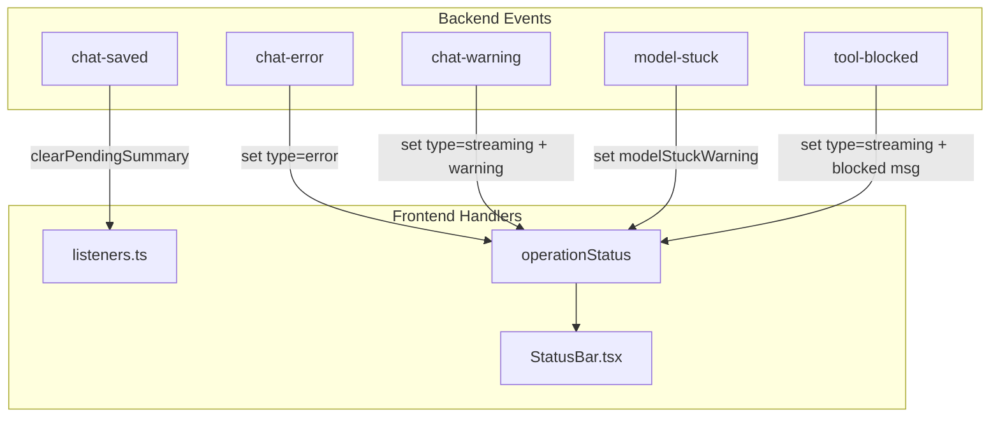

# Event System Cleanup and Status Bar Integration

## Current State

The event system has inconsistencies:

- Two backend events use underscores: `chat_error`, `chat_warning`
- Some backend events are emitted but not used by the frontend
- Some frontend listeners exist for events the backend never emits

## Changes Required

### 1. Backend: Convert Underscore Events to Dashes

In [src-tauri/src/agentic_loop.rs](src-tauri/src/agentic_loop.rs):

- Line 755: `"chat_error"` to `"chat-error"`
- Line 903: `"chat_warning"` to `"chat-warning"`

### 2. Frontend: Add Listeners for New Events

In [src/store/chat/listeners.ts](src/store/chat/listeners.ts), add listeners for:

**`chat-error`** - Fatal chat errors (e.g., failed to send to model gateway)

- Set `operationStatus` with `type: 'error'` and the error message
- Auto-dismiss after 10 seconds

**`chat-warning`** - Non-fatal warnings (e.g., iteration limit reached)

- Set `operationStatus` with `type: 'streaming'` and warning message
- Auto-dismiss after 5 seconds

### 3. Backend: Emit Events Frontend Already Expects

**`chat-saved`** - Currently listened for but never emitted

In [src-tauri/src/actors/vector_actor.rs](src-tauri/src/actors/vector_actor.rs) or after the `save_chat_to_vector_store` call in [src-tauri/src/agentic_loop.rs](src-tauri/src/agentic_loop.rs):

- Emit `"chat-saved"` with the chat_id after successfully saving

**`model-stuck`** - Repetition loop detection

In [src-tauri/src/agentic_loop.rs](src-tauri/src/agentic_loop.rs), the `RepetitionDetector` already logs loop detection. Add:

```rust
app_handle.emit("model-stuck", json!({
    "pattern": pattern,
    "repetitions": repetitions,
    "score": score
}));
```

**`tool-blocked`** - Tool blocked by state machine

In [src-tauri/src/agentic_loop.rs](src-tauri/src/agentic_loop.rs), when a tool is filtered out by the state machine:

```rust
app_handle.emit("tool-blocked", json!({
    "tool": tool_name,
    "state": state_machine.current_state().name(),
    "message": "Tool not allowed in current state"
}));
```

### 4. Update OperationType for Error Status

In [src/store/chat/types.ts](src/store/chat/types.ts):

- `OperationType` already includes `'error'` - no change needed

### 5. Status Bar Enhancements

The [src/components/StatusBar.tsx](src/components/StatusBar.tsx) already handles `type: 'error'` with red styling. No changes needed for display.

## Event Flow Diagram



## Complete Event Inventory

| Event | Backend Emits | Frontend Listens | Status Bar? |

|-------|---------------|------------------|-------------|

| chat-token | Yes | Yes | No (content streaming) |

| chat-finished | Yes | Yes | Clears status |

| chat-error | Fix underscore | Add listener | Yes (error) |

| chat-warning | Fix underscore | Add listener | Yes (warning) |

| chat-saved | Add emit | Yes | No |

| chat-stream-status | Yes | Yes | Yes |

| tool-executing | Yes | Yes | Yes |

| tool-result | Yes | Yes | Yes |

| tool-heartbeat | Yes | Yes | No |

| tool-loop-finished | Yes | Yes | No |

| tool-calls-pending | Yes | Yes | No (dialog) |

| tool-blocked | Add emit | Yes | Yes |

| model-stuck | Add emit | Yes | Yes (warning) |

| model-selected | Yes | Yes | No |

| model-state-changed | Yes | Yes | No |

| model-download-progress | Yes | Yes | Yes |

| model-load-complete | Yes | Yes | Yes |

| model-fallback-required | Yes | Yes | Yes |

| rag-progress | Yes | Yes | Yes |

| startup-progress | Yes | Yes | No |

| system-prompt | Yes | Yes | No |

| service-* events | Yes | Yes | Yes |

| schema-refresh-progress | Yes | Yes | Yes |

| sidebar-update | Yes | Yes | No |

| available-models-changed | Yes | Yes | No |

| embedding-init-progress | Yes | Yes | Yes |