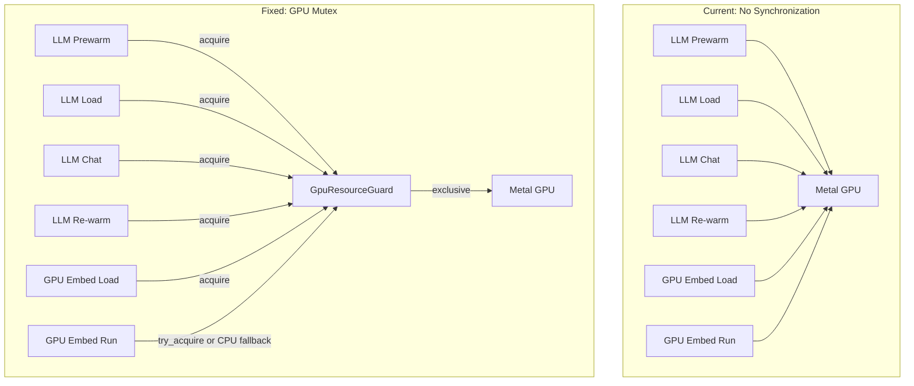

# GPU Mutex Synchronization Plan

## Problem Summary

Multiple GPU operations run concurrently, causing GPU memory contention and silent eviction of models when we're mid-operation. When these overlap, operations hang indefinitely, consuming unbounded memory (70GB+ observed).

## Complete GPU Operation Inventory

### Foundry Local (LLM) Operations - via HTTP to Foundry service

| Operation | Code Location | Endpoint | When Called |

|-----------|---------------|----------|-------------|

| **LLM Prewarm** | `prewarm_model_in_background()` | `/openai/load/{name}` | App startup, model change |

| **LLM Load** | `load_model_impl()` | `/openai/load/{name}` | `LoadModel` message |

| **LLM Unload** | `unload_model_impl()` | `/openai/unload/{name}` | `UnloadModel` message |

| **LLM Chat/Inference** | `Chat` message handler | `/v1/chat/completions` | Every chat turn |

| **LLM Re-warm** | `RewarmCurrentModel` handler | calls `prewarm_model_in_background` | After RAG indexing |

### Fastembed/ONNX (Embedding) Operations - via CoreML/Metal

| Operation | Code Location | When Called |

|-----------|---------------|-------------|

| **GPU Embed Model Load** | `ensure_gpu_embedding_model_loaded()` | Schema refresh, RAG indexing |

| **GPU Embed Inference** | `GetEmbedding` with `use_gpu: true` | RAG indexing |

| **GPU Embed Direct** | `model.embed()` in `embed_table_and_columns` | Schema refresh |

## Architecture



## Mutex Behavior by Operation

| Operation | Mutex Behavior | Fallback if Busy |

|-----------|----------------|------------------|

| LLM Prewarm | Acquire (blocking) | Wait, emit status |

| LLM Load | Acquire (blocking) | Wait, emit status |

| LLM Chat | Acquire (blocking) | Wait, emit "Waiting for GPU..." |

| LLM Re-warm | Acquire (blocking) | Wait |

| GPU Embed Load | Acquire (blocking) | Wait, emit status |

| GPU Embed Inference (RAG) | Try acquire | Use CPU embedding |

| GPU Embed Inference (Schema) | Try acquire | Use CPU embedding |

## Implementation

### 1. Add GPU Mutex to App State

**File:** [src-tauri/src/app_state.rs](src-tauri/src/app_state.rs)

Add a new shared mutex for GPU resource serialization:

```rust
use tokio::sync::Mutex;

/// GPU resource guard to serialize all GPU operations.
/// Only one GPU-intensive operation can run at a time to avoid
/// Metal memory contention between LLM and embedding models.
pub struct GpuResourceGuard {
    /// The mutex that serializes GPU access
    pub mutex: Mutex<()>,
    /// Current operation description (for status feedback)
    pub current_op: RwLock<Option<String>>,
}
```

Add to `ActorHandles` or as a separate Tauri-managed state.

### 2. Pass GPU Guard to ModelGatewayActor

**File:** [src-tauri/src/lib.rs](src-tauri/src/lib.rs)

Create the guard at startup and pass to the actor:

```rust
let gpu_guard = Arc::new(GpuResourceGuard::new());
```

**File:** [src-tauri/src/actors/foundry_actor.rs](src-tauri/src/actors/foundry_actor.rs)

Add field to `ModelGatewayActor` struct and constructor.

### 3. Wrap ALL Foundry LLM Operations with Mutex

**File:** [src-tauri/src/actors/foundry_actor.rs](src-tauri/src/actors/foundry_actor.rs)

#### 3a. LLM Prewarm - `prewarm_model_in_background()`

- Calls `/openai/load/{name}` to load model into VRAM
- Must acquire mutex, update `current_op`, emit status

#### 3b. LLM Load - `LoadModel` message handler

- Calls `load_model_impl()` -> `/openai/load/{name}`
- Must acquire mutex before HTTP call

#### 3c. LLM Unload - `UnloadModel` message handler  

- Calls `unload_model_impl()` -> `/openai/unload/{name}`
- Must acquire mutex (unloading affects GPU state)

#### 3d. LLM Chat - `Chat` message handler

- Calls `/v1/chat/completions` for inference
- Must acquire mutex for duration of streaming response
- Emit "Waiting for GPU..." if blocked

#### 3e. LLM Re-warm - `RewarmCurrentModel` handler

- Calls `prewarm_model_in_background()`
- Mutex acquired inside prewarm function

### 4. Wrap ALL Embedding Operations with Mutex

**File:** [src-tauri/src/actors/foundry_actor.rs](src-tauri/src/actors/foundry_actor.rs)

#### 4a. GPU Embed Model Load - `GetGpuEmbeddingModel` handler

- Calls `ensure_gpu_embedding_model_loaded()`
- Must acquire mutex before loading fastembed with CoreML

#### 4b. GPU Embed Inference - `GetEmbedding` with `use_gpu: true`

- Uses GPU model's `embed()` method
- Must acquire mutex for inference duration

### 5. Add CPU Fallback for Bulk Embedding Operations

**File:** [src-tauri/src/commands/database.rs](src-tauri/src/commands/database.rs)

For `refresh_database_schemas`:

- Try `gpu_guard.mutex.try_lock()`
- If acquired: use GPU embedding model
- If busy: fall back to CPU embedding model with status message

**File:** [src-tauri/src/commands/rag.rs](src-tauri/src/commands/rag.rs)

Same pattern for `process_rag_documents`.

### 6. Status Feedback Events

Emit Tauri events when:

- Waiting for GPU mutex
- GPU operation started
- GPU operation completed
```rust
app_handle.emit("gpu-status", json!({
    "operation": "prewarm",
    "model": "Phi-4-mini",
    "status": "started"  // "waiting", "started", "completed"
}));
```


### 7. Files to Modify

| File | Changes |

|------|---------|

| [src-tauri/src/app_state.rs](src-tauri/src/app_state.rs) | Add `GpuResourceGuard` struct |

| [src-tauri/src/lib.rs](src-tauri/src/lib.rs) | Create guard, pass to actor |

| [src-tauri/src/actors/foundry_actor.rs](src-tauri/src/actors/foundry_actor.rs) | Add mutex to: prewarm, load, unload, chat, rewarm, GetGpuEmbedding, GetEmbedding(gpu) |

| [src-tauri/src/commands/database.rs](src-tauri/src/commands/database.rs) | Try GPU, fallback to CPU |

| [src-tauri/src/commands/rag.rs](src-tauri/src/commands/rag.rs) | Try GPU, fallback to CPU |

## Testing

1. Start app (triggers LLM prewarm)
2. Immediately click Database Refresh (triggers GPU embedding)
3. Verify: No memory explosion, either waits for prewarm or uses CPU fallback
4. Check logs for: "GPU busy, falling back to CPU embeddings" or mutex acquisition order