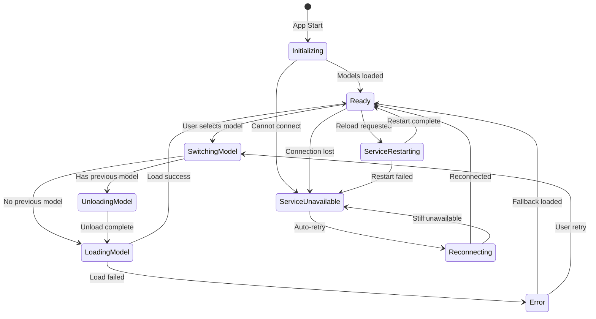

# Model Synchronization State Machine

## Problem Statement

The current model management has several issues:

- Frontend `currentModel` can desync from backend `foundry_actor.model_id`
- User prompts are not blocked during model loading/switching transitions
- VRAM cleanup on model switch is attempted but not guaranteed before new load
- Foundry service unavailable/restarting states don't block prompts

## State Machine Design



## Key Design Decisions

1. **Single Source of Truth**: Backend `FoundryActor` owns the canonical model state
2. **Event-Driven Sync**: Frontend subscribes to `model-state-changed` events
3. **Blocking States**: `SwitchingModel`, `UnloadingModel`, `LoadingModel`, `ServiceUnavailable`, `ServiceRestarting` all block user prompts
4. **VRAM Guarantee**: `UnloadingModel` state waits for explicit unload confirmation before proceeding to `LoadingModel`

## Implementation

### Backend Changes

#### 1. New `ModelState` Type in `protocol.rs`

```rust
#[derive(Debug, Clone, Serialize, Deserialize, PartialEq)]
#[serde(tag = "state", content = "data")]
pub enum ModelState {
    Initializing,
    Ready { model_id: String },
    SwitchingModel { from: Option<String>, to: String },
    UnloadingModel { model_id: String, next_model: String },
    LoadingModel { model_id: String },
    Error { message: String, last_model: Option<String> },
    ServiceUnavailable { message: String },
    ServiceRestarting,
    Reconnecting,
}
```

#### 2. State Management in `foundry_actor.rs`

Add `model_state: ModelState` field and `emit_model_state_changed()` method. All state transitions emit events.

Key changes to [foundry_actor.rs](src-tauri/src/actors/foundry_actor.rs):

- Replace `model_id: Option<String>` with `model_state: ModelState`
- Add `GetModelState` message handler
- Modify `SetModel` to use state transitions
- Ensure `unload_model` completes before `load_model` in switch flow

#### 3. New Tauri Command in `commands/model.rs`

```rust
#[tauri::command]
pub async fn get_model_state(handles: State<'_, ActorHandles>) -> Result<ModelState, String>
```

### Frontend Changes

#### 1. New State in `chat-store.ts`

```typescript
export type ModelStateType = 
  | 'initializing'
  | 'ready'
  | 'switching_model'
  | 'unloading_model'
  | 'loading_model'
  | 'error'
  | 'service_unavailable'
  | 'service_restarting'
  | 'reconnecting';

export interface ModelStateData {
  state: ModelStateType;
  modelId?: string;
  targetModel?: string;
  previousModel?: string;
  errorMessage?: string;
}
```

Add to ChatState:

- `modelState: ModelStateData`
- `isModelReady: boolean` (derived: `state === 'ready'`)

#### 2. Event Listener in `chat-store.ts`

Listen for `model-state-changed` event and update `modelState` accordingly.

#### 3. Input Blocking in `ChatArea.tsx`

Modify input disabled logic:

```typescript
const isModelTransitioning = !['ready'].includes(modelState.state);
const canSubmit = !isModelTransitioning && !assistantStreamingActive && !isStreamingInOtherChat;
```

#### 4. Status Bar Messages in `StatusBar.tsx`

Add new operation types and messages for each model state:

- `switching_model`: "Switching to {model}..."
- `unloading_model`: "Unloading {model} from VRAM..."
- `loading_model`: "Loading {model} into VRAM..."
- `service_unavailable`: "Foundry service unavailable"
- `service_restarting`: "Restarting Foundry service..."

## Files to Modify

- [src-tauri/src/protocol.rs](src-tauri/src/protocol.rs) - Add `ModelState` enum
- [src-tauri/src/actors/foundry_actor.rs](src-tauri/src/actors/foundry_actor.rs) - State machine logic
- [src-tauri/src/commands/model.rs](src-tauri/src/commands/model.rs) - Add `get_model_state` command
- [src-tauri/src/lib.rs](src-tauri/src/lib.rs) - Register new command
- [src/store/chat-store.ts](src/store/chat-store.ts) - Add modelState, listener, derived helpers
- [src/components/ChatArea.tsx](src/components/ChatArea.tsx) - Use modelState for input blocking
- [src/components/StatusBar.tsx](src/components/StatusBar.tsx) - Enhanced status messages

## VRAM Cleanup Flow

When switching models:

1. Transition to `SwitchingModel { from, to }`
2. If `from` is Some, transition to `UnloadingModel` and call `unload_model`
3. Wait for unload response (success or error)
4. Transition to `LoadingModel` and call `load_model`
5. On success, transition to `Ready`; on failure, transition to `Error` and attempt fallback