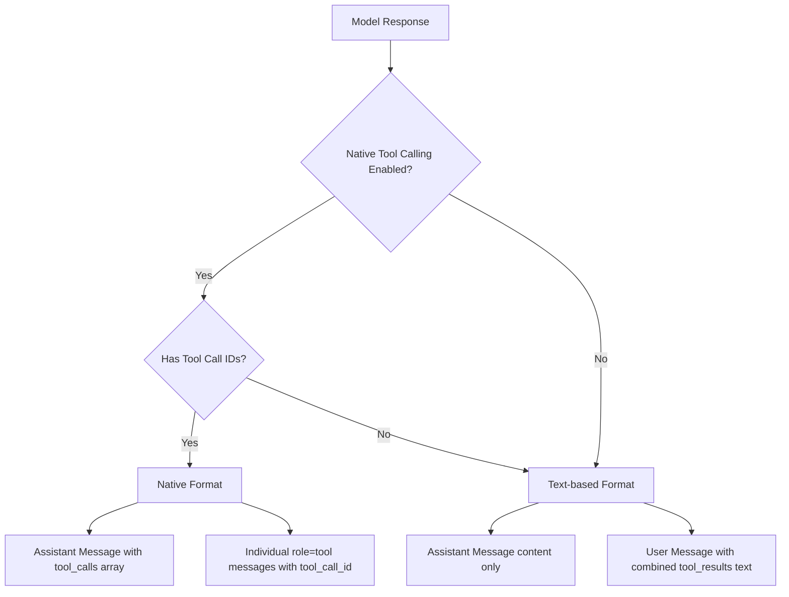

# Native OpenAI Tool Result Message Format

## Current State

Tool results are currently wrapped in user messages with text-based formatting:

```rust
// Current approach in lib.rs (lines 2409-2415)
let combined_results = tool_results.join("\n\n");
full_history.push(ChatMessage {
    role: "user".to_string(),
    content: combined_results,  // e.g., "<tool_result>...</tool_result>"
    system_prompt: None,
});
```

This works but isn't optimal for models that support native tool calling. OpenAI's format uses:

- Assistant messages with a `tool_calls` array
- Separate `role: "tool"` messages with `tool_call_id` referencing the original call

## Changes Required

### 1. Extend `ChatMessage` in [`src-tauri/src/protocol.rs`](src-tauri/src/protocol.rs)

Add optional fields for native tool calling:

```rust
#[derive(Debug, Clone, Serialize, Deserialize)]
pub struct ChatMessage {
    pub role: String,
    pub content: String,
    #[serde(skip_serializing_if = "Option::is_none")]
    pub system_prompt: Option<String>,
    // New fields for native tool calling
    #[serde(skip_serializing_if = "Option::is_none")]
    pub tool_calls: Option<Vec<OpenAIToolCall>>,
    #[serde(skip_serializing_if = "Option::is_none")]
    pub tool_call_id: Option<String>,
}
```

Add the `OpenAIToolCall` struct (matching OpenAI's response format):

```rust
#[derive(Debug, Clone, Serialize, Deserialize)]
pub struct OpenAIToolCall {
    pub id: String,
    #[serde(rename = "type")]
    pub call_type: String,  // Always "function"
    pub function: OpenAIToolCallFunction,
}

#[derive(Debug, Clone, Serialize, Deserialize)]
pub struct OpenAIToolCallFunction {
    pub name: String,
    pub arguments: String,  // JSON string
}
```


### 2. Extend `ParsedToolCall` in [`src-tauri/src/protocol.rs`](src-tauri/src/protocol.rs)

Add optional `id` field to track native tool call IDs:

```rust
pub struct ParsedToolCall {
    pub server: String,
    pub tool: String,
    pub arguments: serde_json::Value,
    pub raw: String,
    #[serde(skip_serializing_if = "Option::is_none")]
    pub id: Option<String>,  // Native tool call ID
}
```


### 3. Update `StreamingToolCalls` in [`src-tauri/src/actors/foundry_actor.rs`](src-tauri/src/actors/foundry_actor.rs)

Propagate the tool call `id` when converting to `ParsedToolCall`:

```rust
fn into_parsed_calls(self) -> Vec<ParsedToolCall> {
    // ...existing code...
    result.push(ParsedToolCall {
        server,
        tool,
        arguments,
        raw,
        id: Some(id),  // Add this
    });
}
```


### 4. Update Agentic Loop in [`src-tauri/src/lib.rs`](src-tauri/src/lib.rs)

When `native_tool_calling_enabled` is true AND we have native tool call IDs:a) After receiving assistant response with tool calls, append the assistant message with `tool_calls` array populatedb) After executing each tool, instead of collecting into `tool_results: Vec<String>`, create individual `ChatMessage` objects:

```rust
if native_tool_calling_enabled && resolved_call.id.is_some() {
    // Native format: individual tool messages
    full_history.push(ChatMessage {
        role: "tool".to_string(),
        content: result_text,
        tool_call_id: resolved_call.id.clone(),
        tool_calls: None,
        system_prompt: None,
    });
} else {
    // Fallback: text-based format in user message
    tool_results.push(format_tool_result(...));
}
```


### 5. Helper Function for Assistant Tool Call Messages

Add a helper to create assistant messages with `tool_calls` when appropriate:

```rust
fn create_assistant_tool_call_message(
    content: &str,
    calls: &[ParsedToolCall],
    use_native: bool,
) -> ChatMessage {
    if use_native && calls.iter().all(|c| c.id.is_some()) {
        ChatMessage {
            role: "assistant".to_string(),
            content: content.to_string(),
            tool_calls: Some(calls.iter().map(|c| OpenAIToolCall {
                id: c.id.clone().unwrap(),
                call_type: "function".to_string(),
                function: OpenAIToolCallFunction {
                    name: format!("{}___{}", c.server, c.tool),
                    arguments: serde_json::to_string(&c.arguments).unwrap_or_default(),
                },
            }).collect()),
            tool_call_id: None,
            system_prompt: None,
        }
    } else {
        // Fallback to content-only
        ChatMessage {
            role: "assistant".to_string(),
            content: content.to_string(),
            tool_calls: None,
            tool_call_id: None,
            system_prompt: None,
        }
    }
}
```


## Flow Diagram




## Backward Compatibility

- Existing `ChatMessage` objects without the new fields will deserialize correctly (they're `Option`)
- Non-native-capable models continue using text-based format in user messages