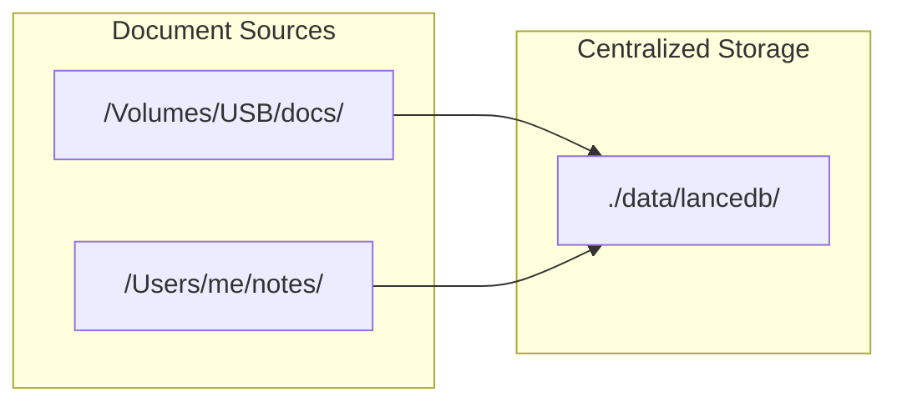
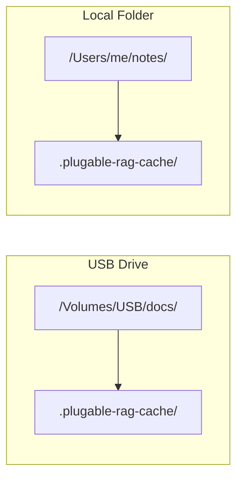

# Portable RAG Embeddings

## Current Architecture

The RAG system uses a single centralized LanceDB at `./data/lancedb`:



## Target Architecture

Each indexed folder gets its own `.plugable-rag-cache/` sidecar:



## Key Changes

### 1. Multi-Connection RAG Actor

Modify [src-tauri/src/actors/rag_actor.rs](src-tauri/src/actors/rag_actor.rs) to manage multiple LanceDB connections:

```rust
pub struct RagRetrievalActor {
    rx: mpsc::Receiver<RagMsg>,
    // Replace single connection with per-directory connections
    connections: HashMap<PathBuf, DirectoryConnection>,
    app_handle: Option<AppHandle>,
    embedding_lru_cache: LruCache<String, Vec<f32>>,
}

struct DirectoryConnection {
    db: Connection,
    chunks_table: Table,
    file_cache_table: Table,
    root_path: PathBuf,
}
```

### 2. Cache Directory Resolution

Add a helper to derive the sidecar cache path from a document path:

```rust
const SIDECAR_CACHE_DIR: &str = ".plugable-rag-cache";

fn get_cache_dir_for_file(file_path: &Path) -> PathBuf {
    // For a file like /Volumes/USB/docs/report.pdf
    // Returns /Volumes/USB/docs/.plugable-rag-cache/
    file_path.parent()
        .unwrap_or(Path::new("."))
        .join(SIDECAR_CACHE_DIR)
}
```

For directory indexing, use the directory itself as the root.

### 3. Lazy Connection Initialization

Replace `init_db()` with on-demand connection creation:

```rust
async fn ensure_connection_for_path(&mut self, file_path: &Path) -> Result<&mut DirectoryConnection, String> {
    let cache_dir = get_cache_dir_for_file(file_path);
    
    if !self.connections.contains_key(&cache_dir) {
        // Create .plugable-rag-cache directory if needed
        tokio::fs::create_dir_all(&cache_dir).await?;
        
        let db = connect(&cache_dir.to_string_lossy()).execute().await?;
        // ... initialize tables ...
        self.connections.insert(cache_dir.clone(), DirectoryConnection { ... });
    }
    
    Ok(self.connections.get_mut(&cache_dir).unwrap())
}
```

### 4. Federated Search

Modify `search_documents` to query all active connections and merge results:

```rust
async fn search_documents(&self, query_vector: Vec<f32>, limit: usize) -> Vec<RagChunk> {
    let mut all_results = Vec::new();
    
    // Query each connection in parallel
    for conn in self.connections.values() {
        let results = self.search_single_connection(conn, &query_vector, limit).await;
        all_results.extend(results);
    }
    
    // Sort by score and take top `limit`
    all_results.sort_by(|a, b| b.score.partial_cmp(&a.score).unwrap());
    all_results.truncate(limit);
    all_results
}
```

### 5. Full Path Storage

Change `source_file` field to store the **full path** instead of just the filename:

```rust
// Before (line 589-592 in rag_actor.rs)
let file_name = file_path.file_name()...

// After
let file_path_str = file_path.to_string_lossy().to_string();
```

This enables:

- Correct file identification when same filename exists in multiple directories
- Proper file removal operations
- UI can display full path for disambiguation

### 6. Protocol Updates

Update [src-tauri/src/protocol.rs](src-tauri/src/protocol.rs) `RagChunk` to include the full path (may already have `source_file` as String).

### 7. Remove Centralized Path

Remove the hardcoded `./data/lancedb` path from RAG actor initialization in [src-tauri/src/lib.rs](src-tauri/src/lib.rs) (lines 6182-6186).

## Migration Strategy

Since the storage location fundamentally changes:

1. Existing centralized cache becomes orphaned (no migration needed - users re-index)
2. First indexing after upgrade creates new sidecar caches
3. Optionally: detect and clean up old `./data/lancedb/rag_*` tables

## Edge Cases

| Scenario | Handling |

|----------|----------|

| Read-only filesystem (CD, locked USB) | Graceful fallback: index in-memory only, log warning |

| Permission denied on cache creation | Return error to user with actionable message |

| Same file indexed from multiple paths (symlinks) | Content-hash deduplication still works; both paths stored |

| Network share disconnected mid-search | Timeout + skip that connection, return partial results |

## Files to Modify

- [src-tauri/src/actors/rag_actor.rs](src-tauri/src/actors/rag_actor.rs) - Core refactor (multi-connection, federated search)
- [src-tauri/src/lib.rs](src-tauri/src/lib.rs) - Remove centralized db_path from actor init
- [src-tauri/src/protocol.rs](src-tauri/src/protocol.rs) - Verify RagChunk supports full paths