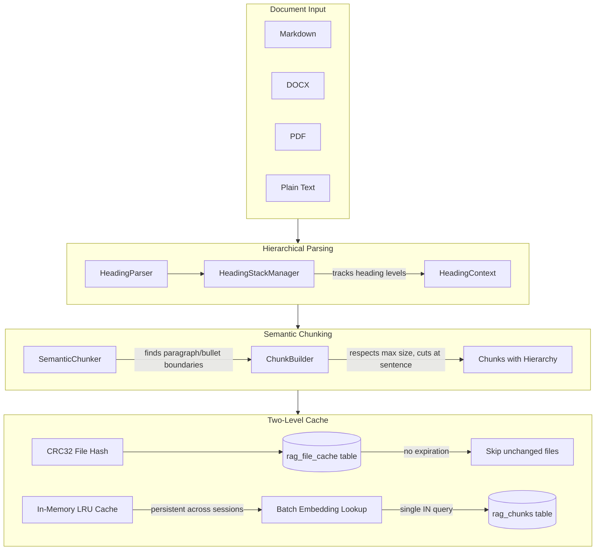

# RAG Hierarchical Chunking Enhancement

## Summary

Replace fixed-size chunking with semantic paragraph/bullet-aware chunking that includes document hierarchy (parent headings) in each chunk. Implement CRC-based file caching with no expiration. Optimize chunk-level embedding cache to eliminate N+1 query patterns and add persistent in-memory caching.

## Architecture




## Part 1: Chunk-Level Cache Optimizations

**Problem**: Current implementation has N+1 query pattern - each chunk's embedding is looked up individually in a loop ([`rag_actor.rs:364`](src-tauri/src/actors/rag_actor.rs)).

### 1.1 Batch Embedding Lookup

Replace sequential lookups:

```rust
// BEFORE (N queries)
for mut chunk in all_pending_chunks {
    if let Some(v) = self.get_cached_embedding(&chunk.hash).await {
        // ...
    }
}
```

With single batch query:

```rust
// AFTER (1 query)
let all_hashes: Vec<&str> = all_pending_chunks.iter().map(|c| c.hash.as_str()).collect();
let cached_embeddings = self.get_cached_embeddings_batch(&all_hashes).await;
// HashMap<String, Vec<f32>> for O(1) lookups
```

Implementation: Build SQL filter like `hash IN ('hash1', 'hash2', ...)` and fetch all matching embeddings in one query.

### 1.2 Persistent In-Memory LRU Cache

Add an LRU cache that persists across indexing sessions:

```rust
pub struct RagRetrievalActor {
    // ... existing fields ...
    /// Persistent LRU cache for chunk embeddings (hash -> vector)
    embedding_lru_cache: lru::LruCache<String, Vec<f32>>,
}
```


- Capacity: ~10,000 embeddings (~150MB for 384-dim vectors)
- Check LRU first, then batch query LanceDB for misses
- Populate LRU from batch query results

## Part 2: File-Level CRC Cache

**Goal**: Skip re-processing files that haven't changed, with no expiration.

### 2.1 New LanceDB Table: `rag_file_cache`

| Column | Type | Description ||--------|------|-------------|| file_path | String | Absolute path to file || crc32 | String | CRC32 hash of file bytes || chunk_count | Int64 | Number of chunks produced || indexed_at | Int64 | Unix timestamp |

### 2.2 Processing Flow

```rust
fn should_reindex_file(&self, path: &Path, bytes: &[u8]) -> bool {
    let current_crc = crc32fast::hash(bytes);
    match self.get_file_cache(path).await {
        Some(cached) if cached.crc32 == current_crc => false, // Skip
        _ => true, // New or changed file
    }
}
```


## Part 3: Hierarchical Heading Context

**Goal**: Each chunk includes its parent headings for better context during retrieval.

### 3.1 HeadingParser Trait

```rust
trait HeadingParser {
    /// Parse document and return structured elements
    fn parse(&self, content: &str) -> Vec<DocumentElement>;
}

enum DocumentElement {
    Heading { level: u8, text: String },
    Paragraph(String),
    ListItem { indent: u8, text: String },
    CodeBlock(String),
}
```


### 3.2 Format-Specific Implementations

| Format | Heading Detection ||--------|-------------------|| Markdown | `#`, `##`, etc. regex patterns || DOCX | Parse `<w:pStyle>` for Heading1-9 styles || PDF | Font size + bold heuristics (largest = H1) || Plain Text | ALL CAPS lines, lines followed by blank, underlined patterns |

### 3.3 HeadingStackManager

Maintains current heading hierarchy as document is parsed:

```rust
struct HeadingStackManager {
    stack: Vec<(u8, String)>, // (level, heading_text)
}

impl HeadingStackManager {
    fn push_heading(&mut self, level: u8, text: String) {
        // Pop all headings at same or lower level
        while self.stack.last().map_or(false, |(l, _)| *l >= level) {
            self.stack.pop();
        }
        self.stack.push((level, text));
    }
    
    fn get_context(&self) -> String {
        // Returns: "H1: Chapter 1 > H2: Section A > H3: Details"
        self.stack.iter()
            .map(|(l, t)| format!("H{}: {}", l, t))
            .collect::<Vec<_>>()
            .join(" > ")
    }
}
```


## Part 4: Semantic Chunking

**Goal**: Chunk at natural boundaries (paragraphs, bullets) instead of fixed character counts.

### 4.1 Chunking Strategy

1. Parse document into `DocumentElement` stream
2. Group elements into chunks, respecting:

- **Soft limit**: 400 chars (target size)
- **Hard limit**: 800 chars (never exceed)
- **Boundaries**: Never split mid-paragraph; prefer splitting between paragraphs

3. If a single paragraph exceeds hard limit:

- Split at sentence boundaries (`. `, `! `, `? `)
- If no sentence boundary, split at line breaks
- Last resort: split at word boundaries

### 4.2 Chunk Content Format

Each chunk's stored content includes heading context:

```javascript
[Context: H1: User Guide > H2: Installation > H3: macOS]

To install on macOS, open Terminal and run the following command:
brew install plugable-chat

This will download and install the latest version...
```


## Part 5: Schema Updates

### 5.1 IndexedChunk Struct

```rust
struct IndexedChunk {
    id: String,
    hash: String,
    file_hash: String,          // Keep for backward compat
    file_crc32: String,         // New: faster CRC
    content: String,            // Now includes heading context
    heading_context: String,    // New: separate field for filtering
    source_file: String,
    chunk_index: usize,
    vector: Vec<f32>,
}
```


### 5.2 LanceDB Schema Migration

Add `heading_context` and `file_crc32` columns. Handle migration by checking field count (existing pattern in codebase).

## Files to Modify

- [`src-tauri/src/actors/rag_actor.rs`](src-tauri/src/actors/rag_actor.rs) - Main changes
- [`src-tauri/src/protocol.rs`](src-tauri/src/protocol.rs) - Update RagChunk struct