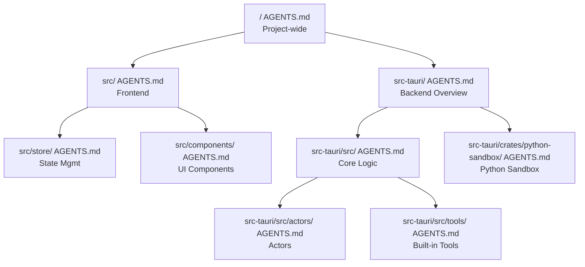

# Refactor AGENTS.md into Cascading Hierarchy

This refactoring will distribute the current monolithic [AGENTS.md](AGENTS.md) into 9 focused files, one per major subdirectory. Each file assumes the parent chain is loaded first and avoids repeating parent content.

## Hierarchy Visualization

## File Breakdown

### 1. Root [AGENTS.md](AGENTS.md) (Trimmed)

Keep only project-wide, cross-cutting concerns:

- Tech Stack summary (React, Tauri, Tailwind, Zustand, npm-only)
- Release Monitoring (Foundry Local)
- Grep-Friendly Identifier Naming (both frontend and backend examples)
- CLI Parity With UI philosophy

### 2. [src/AGENTS.md](src/AGENTS.md) (New)

Frontend-specific guidance:

- Tailwind v4 critical import syntax (`@import "tailwindcss";`)
- Layout System (`fixed inset-0`, no global scrollbars)
- Descriptive UI Selectors (kebab-case, role-first naming)
- CSS Debugging (check `index.css` for global overrides)
- Markdown/Math overrides in `index.css`
- Layout Debugger (`Ctrl+Shift+L`, `debugLayout` in App.tsx)
- `log_to_terminal` Tauri command for debugging

### 3. [src/store/AGENTS.md](src/store/AGENTS.md) (New)

State management specifics:

- Zustand global store in `chat-store.ts`
- Tauri event listener pattern (`chat-token`, `chat-finished`)
- Generation counter guards (`listenerGenerationCounter`)
- Guardrail: don't refactor to simple useEffect without preserving race-condition guards

### 4. [src/components/AGENTS.md](src/components/AGENTS.md) (New)

Component-level guidance:

- Chat Area chronological ordering principle
- Tool call accordions appear when invoked, results appear after
- Formatted results visible in main chat (not hidden in accordion)
- Guardrail: never reorder elements for aesthetics

### 5. [src-tauri/AGENTS.md](src-tauri/AGENTS.md) (New)

Backend overview:

- State Machine Hierarchy overview (3-tier: Settings, Turn, Mid-Turn)
- Backend Integration summary (streaming via `chat-token`, key commands)
- LanceDB Schema Management (location, migration approach, common symptoms)
- Cursor for SQL / Database Toolbox overview

### 6. [src-tauri/src/AGENTS.md](src-tauri/src/AGENTS.md) (New)

Core backend logic:

- State machine file locations (`settings_state_machine.rs`, `state_machine.rs`, `mid_turn_state.rs`)
- Model-Specific Tool Calling Architecture (4 layers)
- System Prompt Building (`build_system_prompt()`)
- Response Parsing (`tool_adapters.rs`)
- Agentic Loop Processing (`run_agentic_loop()`)
- Tool Call Formats (enabled vs primary)
- Debugging log prefixes to watch

### 7. [src-tauri/src/actors/AGENTS.md](src-tauri/src/actors/AGENTS.md) (New)

Actor-specific guidance:

- Model Profiles (`model_profiles.rs`) - ModelFamily, ToolFormat, ReasoningFormat
- Execution Parameters in `foundry_actor.rs` (per-family: GptOss, Phi, Gemma, Granite)
- LanceDB vector_actor details (`get_expected_schema()`, `setup_table()`)
- Database Toolbox Actor architecture, supported databases, caching

### 8. [src-tauri/src/tools/AGENTS.md](src-tauri/src/tools/AGENTS.md) (New)

Built-in tool guidance:

- Code Mode Philosophy (advanced tool use, discover-then-orchestrate)
- Python sandbox sync requirement with `sandbox.rs`
- `ALLOWED_MODULES` duplication for pre-execution validation
- `validate_input()` and `check_imports()` patterns
- Current allowed modules list
- Test command: `cargo test code_execution`

### 9. [src-tauri/crates/python-sandbox/AGENTS.md](src-tauri/crates/python-sandbox/AGENTS.md) (New)

Python sandbox internals:

- `ALLOWED_MODULES` constant (source of truth)
- `SANDBOX_SETUP_CODE` (blocks dangerous builtins)
- Blocked builtins list (`open`, `eval`, `exec`, `compile`, etc.)
- RustPython `freeze-stdlib` limitations
- Test command: `cargo test -p python-sandbox`
- Sync guardrail: update here first, then `code_execution.rs`, then prompts

## Summary

| File | Lines (Est.) | Primary Focus |

|------|-------------|---------------|

| `/AGENTS.md` | ~40 | Project-wide, cross-cutting |

| `src/AGENTS.md` | ~50 | Tailwind v4, CSS, layout, debugging |

| `src/store/AGENTS.md` | ~25 | Zustand, Tauri events, race guards |

| `src/components/AGENTS.md` | ~20 | Chat area chronology, tool UI |

| `src-tauri/AGENTS.md` | ~60 | State machines, LanceDB, DB Toolbox |

| `src-tauri/src/AGENTS.md` | ~80 | Tool calling layers, agentic loop |

| `src-tauri/src/actors/AGENTS.md` | ~50 | Model profiles, actor specifics |

| `src-tauri/src/tools/AGENTS.md` | ~40 | Code mode, sandbox sync |

| `src-tauri/crates/python-sandbox/AGENTS.md` | ~35 | Sandbox internals, allowed modules |