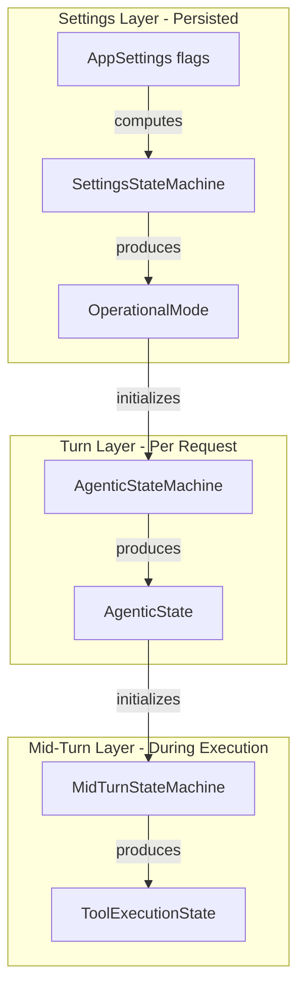

# Settings State Machine Refactor

## Problem Statement

Currently, settings are a flat collection of boolean flags (`python_execution_enabled`, `tool_search_enabled`, `sql_select_enabled`, etc.) in `AppSettings`. The complex interplay between these flags is computed at runtime in multiple places (`compute_enabled_capabilities`, `extract_enabled_builtins`, etc.), leading to:

1. Scattered logic for determining operational modes
2. No single source of truth for "what mode is the system in"
3. Complex flag checking repeated across `lib.rs`, `tool_capability.rs`, and `state_machine.rs`

## Proposed Architecture

A three-tier state machine hierarchy where each tier has a clear responsibility:




### Tier 1: SettingsStateMachine (New)

Computes the **OperationalMode** from settings flags. This runs when settings change (rarely).

```rust
pub enum OperationalMode {
    /// No tools enabled - pure conversation
    Conversational,
    
    /// SQL/database focused: sql_select + schema_search + database_toolbox configured
    SqlMode {
        schema_search_enabled: bool,
        internal_schema_search: bool,
    },
    
    /// Python sandbox with tool calling: python_execution + code_mode
    CodeMode {
        tool_search_enabled: bool,
        python_tool_calling: bool,
    },
    
    /// MCP tool orchestration: native/hermes format + MCP servers
    ToolMode {
        format: ToolCallFormatName,
        deferred_discovery: bool,
    },
    
    /// Multiple capabilities enabled
    HybridMode {
        enabled_modes: HashSet<SimplifiedMode>,
    },
}
```

**Key file**: New [`src-tauri/src/settings_state_machine.rs`](src-tauri/src/settings_state_machine.rs)

### Tier 2: AgenticStateMachine (Refactored)

Currently in [`src-tauri/src/state_machine.rs`](src-tauri/src/state_machine.rs). Refactor to:

- Take `OperationalMode` instead of raw `AppSettings`
- Remove `compute_enabled_capabilities()` - now provided by SettingsStateMachine
- Focus on context-aware state transitions (RAG relevancy, schema relevancy)

### Tier 3: MidTurnStateMachine (New or Extracted)

Currently, mid-turn states exist in `AgenticState` (`SqlResultCommentary`, `CodeExecutionHandoff`, `ToolsDiscovered`). Extract these into a dedicated machine that:

- Takes the current `AgenticState` 
- Manages state during tool execution loops
- Produces `MidTurnState` for prompt continuation

## Implementation Details

### 1. New SettingsStateMachine Module

Create [`src-tauri/src/settings_state_machine.rs`](src-tauri/src/settings_state_machine.rs):

```rust
pub struct SettingsStateMachine {
    current_mode: OperationalMode,
    enabled_capabilities: HashSet<Capability>,
    tool_availability: ToolAvailability,
}

impl SettingsStateMachine {
    pub fn from_settings(settings: &AppSettings, filter: &ToolLaunchFilter) -> Self;
    pub fn operational_mode(&self) -> &OperationalMode;
    pub fn enabled_capabilities(&self) -> &HashSet<Capability>;
    pub fn is_capability_enabled(&self, cap: Capability) -> bool;
}
```


### 2. OperationalMode Enum

The computed "mode" that describes the system's operational posture:| Settings Combination | OperationalMode ||---------------------|-----------------|| No tools enabled | `Conversational` || sql_select + database_toolbox.enabled | `SqlMode` || python_execution + code_mode primary | `CodeMode` || MCP servers + native/hermes format | `ToolMode` || Multiple capabilities | `HybridMode` |

### 3. Refactor AgenticStateMachine

In [`src-tauri/src/state_machine.rs`](src-tauri/src/state_machine.rs):

```rust
impl AgenticStateMachine {
    // New constructor taking OperationalMode
    pub fn new_from_mode(
        mode: &OperationalMode,
        settings_sm: &SettingsStateMachine,
        prompt_context: PromptContext,
    ) -> Self;
    
    // Remove: compute_enabled_capabilities() - delegated to SettingsStateMachine
}
```


### 4. Extract MidTurnStateMachine

Create [`src-tauri/src/mid_turn_state.rs`](src-tauri/src/mid_turn_state.rs):

```rust
pub enum MidTurnState {
    AwaitingModelResponse,
    ProcessingToolCall { tool_name: String },
    SqlResultsReturned { row_count: usize },
    PythonHandoff { stderr: String },
    ToolsDiscovered { tools: Vec<String> },
    Complete,
}

pub struct MidTurnStateMachine {
    current_state: MidTurnState,
    agentic_context: AgenticState,
}
```


### 5. Integration in lib.rs

Update [`src-tauri/src/lib.rs`](src-tauri/src/lib.rs) to use the hierarchy:

```rust
// At app startup or settings change
let settings_sm = SettingsStateMachine::from_settings(&settings, &filter);

// At chat request start  
let agentic_sm = AgenticStateMachine::new_from_mode(
    settings_sm.operational_mode(),
    &settings_sm,
    prompt_context,
);

// During agentic loop
let mut mid_turn_sm = MidTurnStateMachine::new(agentic_sm.current_state());
while mid_turn_sm.should_continue() {
    // ... execute tool, transition state
    mid_turn_sm.handle_event(event);
}
```


## Files to Modify

| File | Changes ||------|---------|| `src-tauri/src/settings_state_machine.rs` | **NEW** - SettingsStateMachine + OperationalMode || `src-tauri/src/mid_turn_state.rs` | **NEW** - MidTurnStateMachine || `src-tauri/src/state_machine.rs` | Refactor to take OperationalMode, remove capability computation || `src-tauri/src/agentic_state.rs` | Extract mid-turn states to new module || `src-tauri/src/lib.rs` | Use new hierarchy, create SettingsStateMachine at startup || `src-tauri/src/tool_capability.rs` | Delegate to SettingsStateMachine || `src-tauri/src/settings.rs` | Add `SettingsStateMachine` integration method |

## Benefits

1. **Single source of truth** - `OperationalMode` captures the system's posture
2. **Clear separation of concerns** - Settings -> Turn -> Mid-Turn
3. **Easier testing** - Each tier can be tested independently