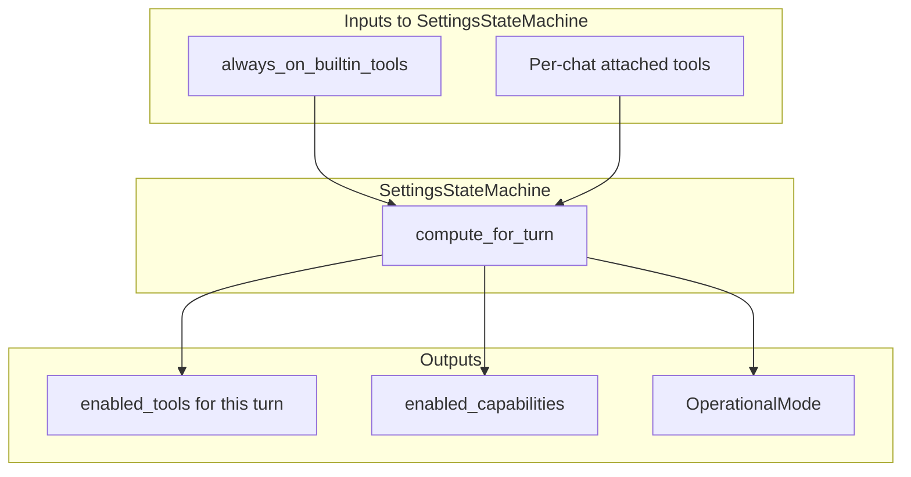

# Simplify Tool Settings Architecture

## Current Problem

The settings state machine has two conflicting inputs for tool enablement:

- `*_enabled` boolean flags (`sql_select_enabled`, `python_execution_enabled`, etc.)
- `always_on_builtin_tools` array

This causes confusion where the UI shows "Off" (based on `always_on_builtin_tools`) but tools are still active (based on `*_enabled` flags).

## Target Architecture

A built-in tool is active for a chat if:

1. It's in `always_on_builtin_tools`, OR
2. It's in the per-chat `attached_tools`

## Key Changes

### 1. Remove Boolean Flags from Settings

**File:** [src-tauri/src/settings.rs](src-tauri/src/settings.rs)

Remove these fields from `AppSettings`:

- `python_execution_enabled`
- `tool_search_enabled`
- `schema_search_enabled`
- `sql_select_enabled`

Keep `always_on_builtin_tools: Vec<String>` as the single source of truth.

### 2. Update SettingsStateMachine

**File:** [src-tauri/src/settings_state_machine.rs](src-tauri/src/settings_state_machine.rs)

- `compute_enabled_capabilities()`: Check `always_on_builtin_tools` only
- `compute_tool_availability()`: Check `always_on_builtin_tools` only
- `compute_for_turn()`: Merge `always_on_builtin_tools` with per-chat `attached_tools`

### 3. Update ToolCapabilityResolver

**File:** [src-tauri/src/tool_capability.rs](src-tauri/src/tool_capability.rs)

- `extract_enabled_builtins()`: Use `always_on_builtin_tools` instead of boolean flags

### 4. Update Tool Registry Sync

**File:** [src-tauri/src/lib.rs](src-tauri/src/lib.rs)

- `sync_registry_database_tools()`: Check `always_on_builtin_tools` instead of boolean flags
- Remove all references to `sql_select_enabled`, `schema_search_enabled`, etc.

### 5. Remove Backend Commands for Boolean Flags

**File:** [src-tauri/src/commands/settings.rs](src-tauri/src/commands/settings.rs)

Remove these commands:

- `update_python_execution_enabled`
- `update_tool_search_enabled`
- `update_schema_search_enabled`
- `update_sql_select_enabled`

Keep `update_always_on_builtin_tools`.

### 6. Update Frontend Settings Store

**File:** [src/store/settings-store.ts](src/store/settings-store.ts)

Remove:

- `python_execution_enabled`, `tool_search_enabled`, `schema_search_enabled`, `sql_select_enabled` from interface
- `updatePythonExecutionEnabled`, `updateToolSearchEnabled`, etc.

Keep:

- `always_on_builtin_tools`
- `addAlwaysOnBuiltinTool`, `removeAlwaysOnBuiltinTool`

### 7. Consolidate Settings UI

**File:** [src/components/Settings.tsx](src/components/Settings.tsx)

Move the "Always On" toggles from the "Tools" tab to the "Built-ins" tab:

- **Remove** the "Built-in Tools" section from the Tools tab (the toggle list with Off/On for each tool)
- **Add** an "Always On" toggle to each tool card in the Built-ins tab

Each tool card in the Built-ins tab will have:

- Tool name and description
- Custom system prompt textarea
- **New:** "Always On" toggle (adds/removes from `always_on_builtin_tools`)

This consolidates all settings for each built-in tool into a single card.

### 8. Handle Migration

**File:** [src-tauri/src/settings.rs](src-tauri/src/settings.rs)

Add migration logic in `load_settings()`:

- If old config has `*_enabled = true` but tool not in `always_on_builtin_tools`, add it
- This ensures users don't lose their enabled tools on upgrade

## Files to Modify

| File | Change |

|------|--------|

| `src-tauri/src/settings.rs` | Remove boolean flags, add migration |

| `src-tauri/src/settings_state_machine.rs` | Use only always_on + attachments |

| `src-tauri/src/tool_capability.rs` | Update extract_enabled_builtins |

| `src-tauri/src/lib.rs` | Update all references to boolean flags |

| `src-tauri/src/commands/settings.rs` | Remove update_*_enabled commands |

| `src/store/settings-store.ts` | Remove boolean fields and methods |

| `src/components/Settings.tsx` | Move always-on toggles from Tools tab to Built-ins tab cards |

## Cleanup

After the refactor:

- Remove debug instrumentation added during this debugging session
- Update tests that reference the removed boolean flags