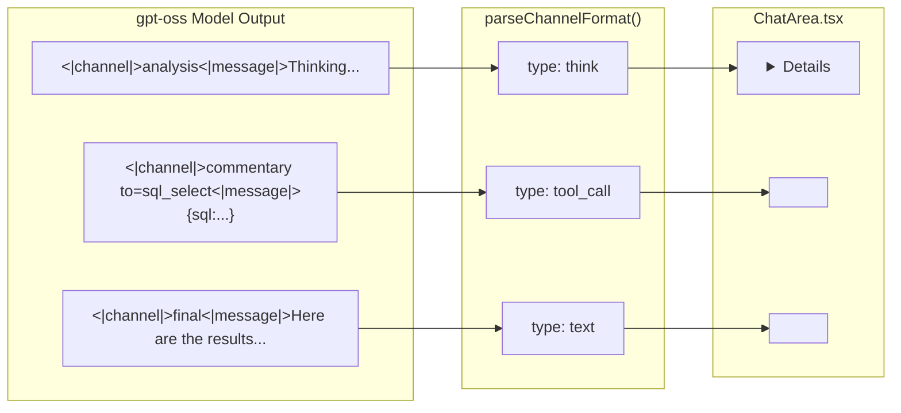

# Full Harmony Format Support for gpt-oss Models

## Harmony Format Specification

The harmony format is OpenAI's structured response format for gpt-oss models. It organizes messages using special tokens, roles, and channels.

### Special Tokens

| Token | Purpose |

|-------|---------|

| `<\|start\|>` | Marks the beginning of a message |

| `<\|end\|>` | Marks the end of a message |

| `<\|message\|>` | Separates the header from the content |

| `<\|channel\|>` | Specifies the communication channel |

| `<\|constrain\|>` | Defines the data type constraint (e.g., `json`) |

| `<\|call\|>` | Indicates a tool invocation (terminates a tool call) |

| `<\|return\|>` | Signals the completion of a response |

### Roles

| Role | Purpose |

|------|---------|

| `system` | Model identity, knowledge cutoff, reasoning effort |

| `developer` | Custom instructions, function definitions, schemas |

| `user` | End-user input |

| `assistant` | Model responses (organized into channels) |

| `tool` | Function execution results |

### Channels (Assistant Messages)

| Channel | Purpose | Visibility | UI Rendering |

|---------|---------|------------|--------------|

| `analysis` | Chain-of-thought reasoning | Hidden | Collapsible accordion |

| `commentary` | Tool calls and preambles | Processed | Tool call accordion |

| `final` | User-facing responses | Shown | Main chat text |

### Tool Call Format

```
<|channel|>commentary to={tool_name} <|constrain|>json<|message|>{arguments}<|call|>
```

Example from the screenshot:

```
<|channel|>commentary to=sql_select <|constrain|>json<|message|>{"sql":"SELECT COUNT(*) AS total_pickpockets FROM main.chicago_crimes WHERE description LIKE '%PICKPOCKET%'"}<|call|>
```

### Tool Result Format

When sending tool results back to the model, use the `tool` role:

```
<|start|>tool to={tool_name}<|message|>{result_json}<|end|>
```

---

## Critical Design Decisions

### 1. System Prompt: NO Explicit Tool Format Instructions

**Key Insight**: gpt-oss models use NATIVE harmony tool calling. They do NOT need explicit format instructions like `<tool_call>` or `[TOOL_CALLS]`. In fact, providing such instructions will CONFUSE the model and cause it to output malformed responses mixing formats.

**Current Problem**: The `openai_style` profile uses `build_tool_system_prompt_openai()` which includes:

```
## Tool Calling Format

When you need to use a tool, output ONLY:
<tool_call>{"name": "tool_name", "arguments": {...}}</tool_call>
```

This is WRONG for gpt-oss models - they have built-in harmony format support.

**Solution**: Create `build_tool_system_prompt_harmony()` that:

- Lists available tools and their descriptions
- Provides factual grounding instructions
- Does NOT specify any explicit tool calling format
- Lets the model use its native harmony format

### 2. UI Rendering: Leverage Existing Architecture

The ChatArea.tsx already has the correct rendering logic:

- `think` parts → `<details>` collapsible accordion
- `tool_call` parts → `<InlineToolCallResult>` accordion component  
- `text` parts → ReactMarkdown rendered content

The only change needed is in the parser (`parseChannelFormat`) to correctly categorize harmony channels:

- `analysis` → `think` (already correct)
- `commentary to=X` → `tool_call` (needs to be added)
- `final` → `text` (already correct)

---

## Implementation Plan

### 1. Backend: Add ToolFormat::Harmony to [src-tauri/src/protocol.rs](src-tauri/src/protocol.rs)

```rust
pub enum ToolFormat {
    OpenAI,
    Hermes,
    Gemini,
    Granite,
    TextBased,
    Harmony,  // NEW: OpenAI harmony format for gpt-oss models
}
```

### 2. Backend: Add Harmony System Prompt Builder in [src-tauri/src/model_profiles.rs](src-tauri/src/model_profiles.rs)

**Critical**: No explicit tool format instructions - gpt-oss uses native harmony format.

```rust
/// Build system prompt for harmony format models (gpt-oss).
/// 
/// IMPORTANT: Do NOT include explicit tool calling format instructions.
/// gpt-oss models use native harmony format for tool calls - providing
/// conflicting instructions (like <tool_call> tags) will confuse the model.
fn build_tool_system_prompt_harmony(
    &self,
    tools: &[ToolSchema],
    options: &PromptOptions,
) -> String {
    if options.code_mode_enabled {
        return Self::python_only_tool_prompt(tools);
    }

    let mut prompt = String::from(
        "You are a helpful assistant with tool-calling capabilities.\n\n"
    );

    // Factual grounding - still important
    prompt.push_str("## Factual Grounding\n\n");
    prompt.push_str("**CRITICAL**: Never make up, infer, or guess data values. ");
    prompt.push_str("All factual information MUST come from executing tools. ");
    prompt.push_str("If you need data, call the appropriate tool first.\n\n");

    // List available tools WITHOUT format instructions
    // The model will use its native harmony format
    prompt.push_str("## Available Tools\n\n");
    for tool in tools.iter().filter(|t| !t.defer_loading) {
        self.append_tool_description(&mut prompt, tool);
    }

    // DO NOT add any "Tool Calling Format" section
    // gpt-oss uses native harmony format

    prompt
}
```

Also update `build_prompt()` to route to harmony prompt builder:

```rust
pub fn build_prompt(
    &self,
    history: &[ChatMessage],
    tools: &[ToolSchema],
    options: &PromptOptions,
) -> ModelInput {
    match self.tool_call_format {
        ToolFormat::Harmony => self.build_prompt_harmony(history, tools, options),
        // ... existing matches
        _ => match self.model_family {
            ModelFamily::GptOss => self.build_prompt_openai_style(history, tools, options),
            // ... existing matches
        }
    }
}
```

### 3. Backend: Implement harmony parser in [src-tauri/src/tool_adapters.rs](src-tauri/src/tool_adapters.rs)

```rust
/// Parse harmony-format tool calls from gpt-oss models
/// Format: <|channel|>commentary to={tool_name} <|constrain|>{type}<|message|>{arguments}<|call|>
pub fn parse_harmony_tool_calls(content: &str) -> Vec<ParsedToolCall> {
    let mut calls = Vec::new();
    
    // Match: <|channel|>commentary to=TOOL_NAME ... <|message|>ARGS<|call|> or <|end|>
    let re = Regex::new(
        r"(?s)<\|channel\|>commentary\s+to=(\S+).*?<\|message\|>(.*?)(?:<\|call\|>|<\|end\|>|$)"
    ).unwrap();
    
    for cap in re.captures_iter(content) {
        let tool_name = cap.get(1).map(|m| m.as_str().trim()).unwrap_or("");
        let args_str = cap.get(2).map(|m| m.as_str().trim()).unwrap_or("{}");
        
        // Parse arguments JSON directly (not wrapped in {"name": ..., "arguments": ...})
        let arguments = serde_json::from_str::<Value>(args_str)
            .unwrap_or(Value::Object(Map::new()));
        
        let (server, tool) = parse_combined_tool_name(tool_name);
        
        calls.push(ParsedToolCall {
            server,
            tool,
            arguments,
            raw: cap.get(0).map(|m| m.as_str().to_string()).unwrap_or_default(),
            id: None,
        });
    }
    
    calls
}
```

### 4. Backend: Harmony Tool Result Formatting in [src-tauri/src/tool_adapters.rs](src-tauri/src/tool_adapters.rs)

```rust
ToolFormat::Harmony => {
    // Harmony uses <|start|>tool to={tool_name}<|message|>{result}<|end|>
    if is_error {
        format!(
            "<|start|>tool to={}<|message|>{{\"error\": \"{}\"}}<|end|>{}",
            call.tool,
            result.replace('"', "\\\""),
            guidance
        )
    } else {
        format!(
            "<|start|>tool to={}<|message|>{}<|end|>{}",
            call.tool,
            result,
            guidance
        )
    }
}
```

### 5. Backend: Create gpt-oss Model Profile in [src-tauri/src/model_profiles.rs](src-tauri/src/model_profiles.rs)

```rust
// In PROFILES static:

// gpt-oss models - use native harmony format (before openai_style to take precedence)
ModelProfile::new(
    "gpt_oss_harmony",
    r"gpt-oss",
    ModelFamily::GptOss,
    ToolFormat::Harmony,  // Use harmony, not Hermes
),

// OpenAI-style models (Qwen, LLaMA-Instruct) - keep using Hermes
ModelProfile::new(
    "openai_style",
    r"qwen|llama.*instruct|mistral.*instruct",  // Removed gpt-oss
    ModelFamily::GptOss,  // Still use GptOss family for message structure
    ToolFormat::Hermes,
),
```

### 6. Frontend: Update parseChannelFormat in [src/lib/response-parser.ts](src/lib/response-parser.ts)

```typescript
/**
 * Parse gpt-oss channel format including harmony tool calls:
 * - <|channel|>analysis<|message|>... -> think
 * - <|channel|>commentary to=TOOL<|constrain|>json<|message|>... -> tool_call
 * - <|channel|>final<|message|>... -> text
 */
function parseChannelFormat(content: string): MessagePart[] {
    const parts: MessagePart[] = [];
    
    // Updated regex to capture:
    // 1. Channel type (analysis, commentary, final)
    // 2. Optional to= attribute (for commentary tool calls)
    // 3. Message content (between <|message|> and terminator)
    const channelPattern = 
        /<\|channel\|>(\w+)(?:\s+to=(\S+))?(?:\s+<\|constrain\|>\w+)?<\|message\|>([\s\S]*?)(?:<\|call\|>|<\|end\|>|(?=<\|channel\|>)|$)/g;
    
    let match;
    while ((match = channelPattern.exec(content)) !== null) {
        const channelType = match[1].toLowerCase();
        const toolName = match[2];  // May be undefined
        const channelContent = match[3];
        
        if (channelType === 'analysis') {
            // Analysis channel = thinking/reasoning content
            if (channelContent.trim()) {
                parts.push({ type: 'think', content: channelContent.trim() });
            }
        } else if (channelType === 'commentary') {
            if (toolName) {
                // Commentary with to= attribute = tool call
                // Arguments are JSON directly, not wrapped in {"name": ..., "arguments": ...}
                try {
                    const args = JSON.parse(channelContent.trim());
                    const toolCallJson = JSON.stringify({
                        name: toolName,
                        arguments: args
                    });
                    parts.push({ type: 'tool_call', content: toolCallJson });
                } catch {
                    // If JSON parse fails, still emit as tool_call with raw content
                    parts.push({ type: 'tool_call', content: JSON.stringify({
                        name: toolName,
                        arguments: { _raw: channelContent.trim() }
                    })});
                }
            } else {
                // Commentary without to= = preamble/explanation text
                if (channelContent.trim()) {
                    parts.push({ type: 'text', content: channelContent.trim() });
                }
            }
        } else if (channelType === 'final') {
            // Final channel = user-facing response
            if (channelContent.trim()) {
                parts.push({ type: 'text', content: channelContent.trim() });
            }
        } else {
            // Unknown channel type - treat as text
            if (channelContent.trim()) {
                parts.push({ type: 'text', content: channelContent.trim() });
            }
        }
    }
    
    // ... rest of existing logic for edge cases
    
    return parts;
}
```

### 7. Frontend: Verify UI Rendering in [src/components/ChatArea.tsx](src/components/ChatArea.tsx)

The existing `AssistantMessage` component already has correct rendering logic:

```typescript
// Already in ChatArea.tsx - works for harmony:
parsedParts.forEach((part, idx) => {
    if (part.type === 'think') {
        // Renders collapsible accordion for analysis channel
        nodes.push(
            <details key={`think-${idx}`} className="mb-4 group">
                <summary>...</summary>
                <div className="...">{part.content || "Thinking..."}</div>
            </details>
        );
    }
    
    if (part.type === 'tool_call') {
        // Renders tool call accordion for commentary channel
        nodes.push(
            <InlineToolCallResult key={`toolcall-${...}`} call={toolCallRecord} />
        );
    }
    
    // text parts render as markdown - for final channel
});
```

**No changes needed** - just verify the parsed parts flow through correctly.

---

## Diagram: Harmony Channel to UI Mapping



---

## Test Cases

### System Prompt Tests

```rust
#[test]
fn test_harmony_system_prompt_no_format_instructions() {
    let profile = resolve_profile("gpt-oss-20b");
    let tools = vec![ToolSchema::new("sql_select")];
    let options = PromptOptions::default();
    
    let input = profile.build_prompt(&[], &tools, &options);
    let system_content = &input.messages[0].content;
    
    // Should NOT contain explicit format instructions
    assert!(!system_content.contains("<tool_call>"));
    assert!(!system_content.contains("[TOOL_CALLS]"));
    assert!(!system_content.contains("<function_call>"));
    
    // Should contain tool descriptions
    assert!(system_content.contains("sql_select"));
    assert!(system_content.contains("Available Tools"));
}
```

### Backend Parsing Tests

```rust
#[test]
fn test_parse_harmony_tool_call() {
    let content = r#"<|channel|>commentary to=sql_select <|constrain|>json<|message|>{"sql":"SELECT * FROM users"}<|call|>"#;
    let calls = parse_harmony_tool_calls(content);
    assert_eq!(calls.len(), 1);
    assert_eq!(calls[0].tool, "sql_select");
    assert_eq!(calls[0].arguments["sql"], "SELECT * FROM users");
}

#[test]
fn test_parse_harmony_multiple_channels() {
    let content = r#"<|channel|>analysis<|message|>Let me search...<|end|><|channel|>commentary to=sql_select <|constrain|>json<|message|>{"sql":"SELECT 1"}<|call|><|channel|>final<|message|>Done!<|end|>"#;
    let calls = parse_harmony_tool_calls(content);
    assert_eq!(calls.len(), 1);  // Only commentary with to= is a tool call
    assert_eq!(calls[0].tool, "sql_select");
}
```

### Frontend Parsing Tests

```typescript
test('parseChannelFormat maps harmony channels correctly', () => {
    const content = `<|channel|>analysis<|message|>Thinking about the query...<|end|>` +
        `<|channel|>commentary to=sql_select <|constrain|>json<|message|>{"sql":"SELECT 1"}<|call|>` +
        `<|channel|>final<|message|>Here are the results.<|end|>`;
    
    const parts = parseMessageContent(content, 'gpt_oss');
    
    expect(parts.length).toBe(3);
    expect(parts[0].type).toBe('think');
    expect(parts[0].content).toContain('Thinking about');
    expect(parts[1].type).toBe('tool_call');
    expect(parts[2].type).toBe('text');
    expect(parts[2].content).toContain('results');
});
```

---

## Key Differences from Current Implementation

| Aspect | Current (Hermes) | Harmony (gpt-oss) |

|--------|------------------|-------------------|

| **System prompt** | Includes `<tool_call>` format instructions | NO format instructions (native) |

| Tool call wrapper | `<tool_call>JSON</tool_call>` | `<\|channel\|>commentary to=X...<\|call\|>` |

| Tool name location | Inside JSON: `{"name": "X", ...}` | In channel header: `to=X` |

| Arguments format | Wrapped: `{"name": "X", "arguments": {...}}` | Direct JSON: `{...}` |

| Thinking content | `<think>...</think>` | `<\|channel\|>analysis<\|message\|>...` |

| **UI: Reasoning** | Collapsible accordion | Collapsible accordion (same) |

| **UI: Tool calls** | Tool call accordion | Tool call accordion (same) |

| **UI: Final answer** | Main chat text | Main chat text (same) |