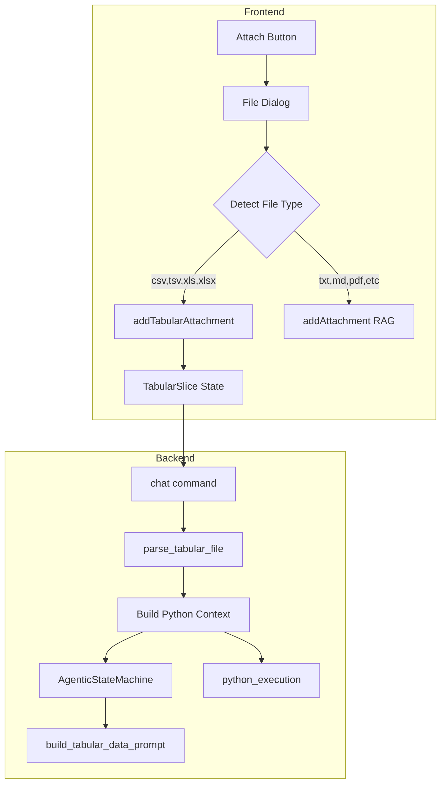
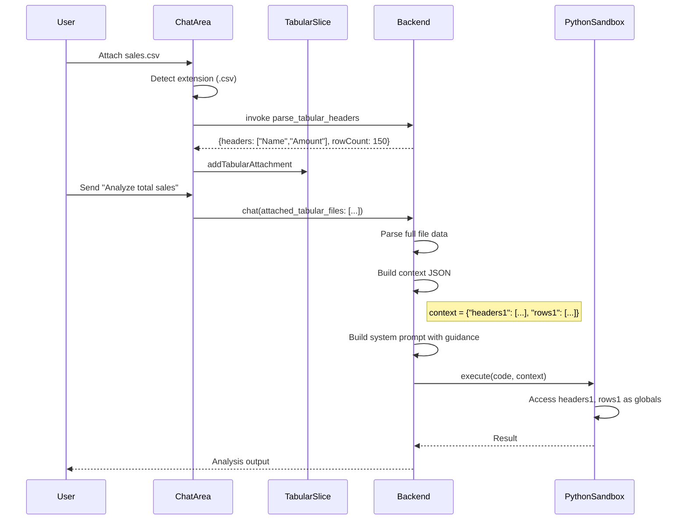

# Tabular File Attachment Feature

This feature mirrors the database table attachment pattern but for file-based tabular data. When a user attaches a CSV/TSV/XLS/XLSX file, the system will:

1. Parse headers and rows from the file
2. Inject them as Python variables (`headers1`, `rows1`, etc.)
3. Auto-enable the `python_execution` tool
4. Include Python data analysis guidance in the system prompt

## Architecture Overview



## Key Files to Create/Modify

### Backend (Rust)

1. **New: `src-tauri/src/tabular_parser.rs`** - File parsing and type inference module

   - Add `calamine` crate for Excel support, `chrono` for date parsing
   - Functions:
     - `parse_tabular_file()` - Main entry point
     - `detect_delimiter()` - CSV vs TSV detection
     - `parse_csv()`, `parse_excel()` - Format-specific parsing
     - `infer_and_convert()` - Type inference for each cell
     - `try_parse_numeric()` - Handle currency, percentages, thousands sep
     - `try_parse_datetime()` - Try multiple date formats
     - `is_missing_value()` - Detect null/NA/empty values
   - Returns: `TabularFileData { headers: Vec<String>, rows: Vec<Vec<TypedValue>>, column_types: Vec<ColumnType> }`
   - `TypedValue` enum: `Null | Int(i64) | Float(f64) | DateTime(NaiveDateTime) | Bool(bool) | String(String)`

2. **Modify: `src-tauri/src/settings_state_machine.rs`**

   - Add `AttachedTabularFile` struct (path, headers, row_count, variable_index)
   - Extend `ChatTurnContext` with `attached_tabular_files: Vec<AttachedTabularFile>`
   - Add `Capability::TabularDataAnalysis` variant

3. **Modify: `src-tauri/src/lib.rs`** (`chat` command)

   - Accept new `attached_tabular_files` parameter
   - Parse files and build Python context JSON with `headers1`/`rows1` variables
   - Auto-enable `python_execution` when tabular files attached

4. **Modify: `src-tauri/src/system_prompt.rs`**

   - Add `build_tabular_data_prompt()` function with Python analysis guidance
   - Include variable names and sample data preview

5. **Modify: `src-tauri/src/state_machine.rs`**

   - Handle `TabularDataAnalysis` capability in `compute_turn_config()`
   - Add prompt section builder for tabular data

6. **Modify: `src-tauri/src/cli.rs`**

   - Add `--table-file` CLI argument (comma-separated paths)

7. **Modify: `src-tauri/Cargo.toml`**

   - Add `calamine` dependency for Excel parsing (`chrono` already present)

### Frontend (TypeScript/React)

8. **Modify: `src/store/chat/slices/attachment-slice.ts`**

   - Add `attachedTabularFiles: AttachedTabularFile[]`
   - Add `addTabularAttachment()`, `removeTabularAttachment()`, `clearTabularAttachments()`

9. **Modify: `src/store/chat/types.ts`**

   - Add `AttachedTabularFile` interface

10. **Modify: `src/components/chat/ChatArea.tsx`**

    - Route tabular file extensions to new handler
    - Add extensions: `xls`, `xlsx` to file dialog

11. **New: `src/components/chat/attachments/TabularFilePills.tsx`**

    - Display attached tabular files with header preview
    - Show row count badge

## Data Flow



## Data Preprocessing (Error Reduction)

The orchestration layer preprocesses tabular data to reduce model errors. This follows the "Cursor for SQL" philosophy: do the heavy lifting so small models succeed.

### Preprocessing Pipeline


### Type Inference Rules

| Raw Value Pattern | Inferred Type | Converted Value |

|------------------|---------------|-----------------|

| Empty, "N/A", "null", "NULL", "-", "NA" | None | `None` |

| Integer pattern (`123`, `-456`) | int | `123` |

| Float pattern (`12.34`, `.5`, `1.`) | float | `12.34` |

| Currency (`$1,234.56`, `€99.99`) | float | `1234.56` |

| Percentage (`50%`, `12.5%`) | float | `0.50` |

| Date patterns (various) | datetime | `datetime(2024, 1, 15)` |

| Everything else | str | `"value"` |

### Cleaning Rules

- **Currency symbols**: Strip `$`, `€`, `£`, `¥` before numeric parsing
- **Thousands separators**: Remove `,` from numbers (`1,234` → `1234`)
- **Percentages**: Divide by 100 (`50%` → `0.50`)
- **Whitespace**: Strip leading/trailing whitespace from all values
- **Quotes**: Remove surrounding quotes if present

### Date Parsing

Attempt to parse common date formats in order:

1. ISO format: `2024-01-15`, `2024-01-15T10:30:00`
2. US format: `01/15/2024`, `1/15/24`
3. EU format: `15/01/2024`, `15-01-2024`
4. Month name: `Jan 15, 2024`, `15 January 2024`

If parsing fails, keep as string.

### Implementation in `tabular_parser.rs`

```rust
pub struct TypedValue {
    // Serializes to JSON for Python injection
}

pub enum InferredType {
    Null,
    Int(i64),
    Float(f64),
    DateTime(chrono::NaiveDateTime),
    String(String),
}

fn infer_and_convert(raw: &str) -> InferredType {
    let trimmed = raw.trim();
    
    // Check for null/missing
    if is_missing_value(trimmed) {
        return InferredType::Null;
    }
    
    // Try numeric (with currency/percentage handling)
    if let Some(num) = try_parse_numeric(trimmed) {
        return num;
    }
    
    // Try datetime
    if let Some(dt) = try_parse_datetime(trimmed) {
        return InferredType::DateTime(dt);
    }
    
    // Fall back to string
    InferredType::String(trimmed.to_string())
}
```

## Python Variable Format

Variables are injected as Python globals with **typed values**:

```python
from datetime import datetime

# Single file attached - values are pre-typed!
headers1 = ("name", "age", "salary", "hire_date", "active")
rows1 = [
    ("Alice", 30, 75000.50, datetime(2024, 1, 15), True),
    ("Bob", None, 82000.00, datetime(2023, 6, 1), True),   # Missing age → None
    ("Carol", 28, None, datetime(2022, 3, 10), False),     # Missing salary → None
]

# Multiple files: headers2/rows2, headers3/rows3, etc.
```

### Column Type Metadata

For each file, also inject column type info for the system prompt:

```python
# Auto-generated metadata (for prompt only, not injected)
columns1 = {
    "name": "str",
    "age": "int",        # Has 1 None value
    "salary": "float",   # Has 1 None value  
    "hire_date": "datetime",
    "active": "bool"
}
```

## System Prompt Section (Example)

````
## Tabular Data Analysis

You have tabular data files available as Python variables:

**File 1: sales.csv** (150 rows)
- `headers1` = ("date", "product", "amount", "region")
- `rows1` = list of 150 tuples

Column types (auto-detected):
| Column | Type | Notes |
|--------|------|-------|
| date | datetime | Use .year, .month, .day |
| product | str | |
| amount | float | Currency cleaned, 3 None values |
| region | str | |

**GUARANTEES** (preprocessing already done):
- Numeric columns are int/float (no casting needed)
- Missing values are Python `None` (not strings like "N/A")
- Currency symbols and commas already stripped
- Percentages converted to decimals (50% → 0.50)
- Dates are datetime objects (use .year, .month, .strftime())

**USAGE PATTERNS**:
```python
# Sum a column (handle None)
total = sum(r[2] for r in rows1 if r[2] is not None)

# Filter rows
q1_sales = [r for r in rows1 if r[0].month <= 3]

# Group by region
from collections import defaultdict
by_region = defaultdict(list)
for r in rows1:
    by_region[r[3]].append(r)

# Access by name (convert row to dict)
for r in rows1:
    row = dict(zip(headers1, r))
    print(row["product"], row["amount"])
````
```

## Key Implementation Details

- **Variable Numbering**: Files are numbered in attachment order (1-indexed)
- **Typed Values**: int, float, datetime, str, bool, or None - NO raw strings for numbers
- **None for Missing**: Empty, "N/A", "null", "-" all become Python `None`
- **No RAG**: Tabular attachments do NOT trigger RAG indexing
- **Auto Python**: Attaching tabular files auto-enables `python_execution`
- **Extension Detection**: `.csv`, `.tsv`, `.xls`, `.xlsx` trigger tabular path
- **datetime Import**: Automatically available in sandbox (already in allowed modules)