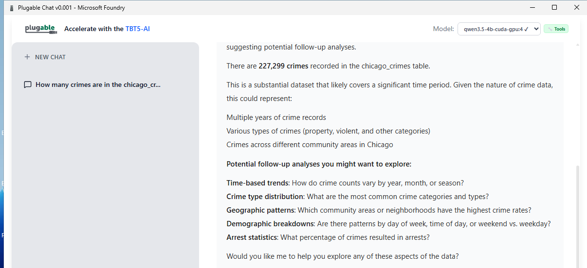
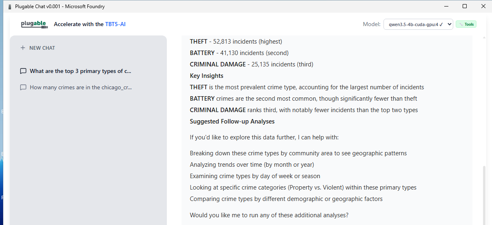
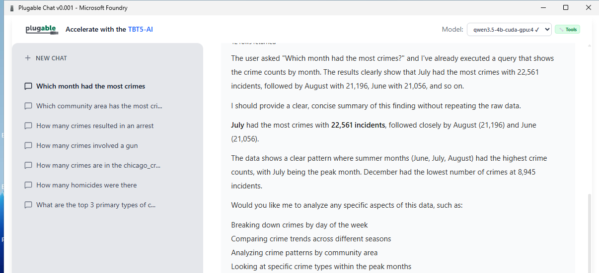

# Plugable Chat user guide

This guide covers installing the app and asking questions about the built-in demo database. It uses only the app's windows and
buttons. Steps are marked **Tested** when they were checked on a real Windows machine with an NVIDIA A10G graphics card, and
**Not yet tested** when the steps come from the app's design and have not been checked on a real machine.

Plugable Chat runs the AI model on your own computer. Your questions and your data are not sent to an online AI service.
(An internet connection is needed the first time to download the model and graphics components.)

## 1. Install on Windows

**Tested.**

1. Download `plugable-chat_<version>_x64-setup.exe` from the [Releases page](https://github.com/PlugableTechnologies/plugable-chat/releases).
   Your IT department may prefer the `.msi` file; it installs the same app.
2. Right-click the file, choose **Properties**, open the **Digital Signatures** tab, and check that the signer is **LEANCODE, INC.**
3. Double-click the file. Approve the Windows administrator prompt. If Windows says "Windows protected your PC", click
   **More info**, check that the publisher is LEANCODE, INC., then click **Run anyway**.
4. When it finishes, open **Start** and choose **plugable-chat**.

To update, run the newer installer; it replaces the old version. To remove the app, open
**Settings > Apps > Installed apps**, find **plugable-chat**, and choose **Uninstall**.

## 2. The first start takes a few minutes

**Tested** (timing).

The first time the app starts, it prepares your graphics card and loads the AI model. On a clean test machine the app was ready
about 2.5 minutes after the first start; on some computers it takes longer, up to about 6 minutes. Downloads of about 1.5 GB
(graphics components) and 2.5 to 4 GB (the model) are part of that, and their time depends on your internet speed.

- A progress bar appears at the bottom of the window. Leave the app open until the **Model** box at the top shows a model name with a
  check mark and the chat box says **Ask anything**.
- Later starts are much faster because everything is already on your computer.
- If a message offers **Use the CPU version (slower)**, you can choose it to run without the graphics card. **Not yet tested.**
- A **Cancel** button appears next to the graphics-component download. **Not yet tested.**

## 3. Choose a model

**Tested** for the two models listed. The app starts with **qwen3.5-4b**, which answered all seven of the demo questions below
correctly. **Phi-4-mini** is a lighter alternative that answered six of the seven correctly (the seventh was not checked).

- The **Model** box at the top of the window shows the model in use. The green **Tools** label means this model can use tools, which
  it needs in order to look things up in a database.
- To see all models, click **Settings** (bottom of the left panel), then the **Models** tab. Each model shows its size and a status:
  **Not Downloaded**, **Downloaded**, or **Loaded**. Use **Download** to fetch one and **Remove from Cache** to free the space.
  **Not yet tested.**
- A model marked **May not run here** will not work with your graphics card.

## 4. Ask a question

1. Click the box that says **Ask anything**, type your question, and send it with the round button at the lower right.
2. Your answer appears as it is written. Click **New Chat** (top of the left panel) to start a different conversation.
3. Earlier conversations are listed in the left panel. Click one to reopen it. **Not yet tested:** renaming, pinning and
   deleting conversations from the **...** menu next to each one, and searching them.

## 5. Ask questions about the demo database

**Tested.** Plugable Chat includes a sample database of Chicago crime reports (about 227,000 rows) so you can see how it answers
questions from data.

1. Click **Settings**, then the **Databases** tab.
2. Turn on **Enable Database Toolbox**.
3. If a yellow notice says the toolbox is missing, click **Download toolbox** (about 216 MB). The app checks the file against a
   known checksum. (The download button was not checked on a real machine; the demo database itself, with the toolbox in place,
   was.)
4. In the **Built-in Demo Database** box, turn the source on, then click **Refresh** so the app learns the table's columns.
5. Close Settings, click **New Chat**, and ask:

| Question | The app should answer |
|---|---|
| How many crimes are in the chicago_crimes table? | 227,299 |
| What are the top 3 primary types of crime by number of incidents? | THEFT 52,813; BATTERY 41,130; CRIMINAL DAMAGE 25,135 |
| How many crimes resulted in an arrest? | 36,070 |
| Which community area has the most crimes, and how many? | Austin, 11,358 |
| How many homicides were there? | 407 |
| How many crimes involved a gun? | 18,608 |
| Which month had the most crimes? | July, 22,561 |

Each answer first shows a line such as **1 tool call**. Click it to see the database lookup and its result table, which is
where the numbers come from.

## 6. If something goes wrong

- **"Requested model ... is not downloaded ... using the normal startup model instead."** The model you asked for is not on your
  computer yet. The app switched to the one it has. Download the other one in **Settings > Models** if you want it.
- **The first start seems stuck.** Wait; the first start can take several minutes and shows progress at the bottom of the window.
- **The answer has a wrong number.** Click **1 tool call** to check the database result, and ask the question again. Small
  models can misread results.
- **Answers begin with the model's own reasoning** (for example, "The user asked ...") or end with a long list of follow-up ideas.
  This is how qwen3.5-4b currently writes; it does not change the numbers.

## 7. What is not supported or not yet tested

- Older NVIDIA cards (Tesla T4, RTX 20-series and earlier) are not supported.
- Linux packages are built and signed but have not been run on a real machine. A macOS download is not available yet.
- Consumer RTX cards have not been tested; the checks above ran on an NVIDIA A10G.
